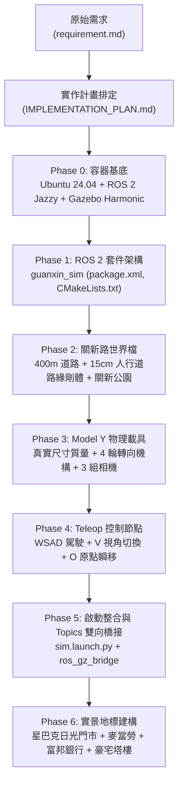

# 新竹關新路自駕與街區模擬專案 (Hsinchu Guanxin Sim)

本專案使用 **Docker 容器化隔離環境**，整合 **ROS 2 Jazzy Jalisco** 與 **Gazebo Harmonic (Gz Sim 8)**，建構台灣新竹市東區「關新路商圈」（光復路口至新莊火車站，含關新公園/日光公園）之高擬真 3D 物理街區，並搭載具備真實阿克曼轉向（Ackermann Steering）與三相機視角串流之 **Tesla Model Y** 電動車模型與鍵盤互動節點。

---

## 📌 FOR AI AGENT: 規範與工作紀錄請求

> [!IMPORTANT]
> ### 🤖 AI AGENT 開發維護守則 (MANDATORY INSTRUCTIONS FOR AI AGENTS)
> 1. **Prompt 需求解析與紀錄**：每當接收到使用者的最新提示詞（User Prompt）時，AI Agent **必須**先解析需求重點，並在實作完成後，將該次變更的背景、修改檔案、架構調整與驗證結果，**持續同步記錄於本文檔後方的 [📝 需求與實作歷程更新日誌 (Update Log)](#-需求與實作歷程更新日誌-update-log) 章節中**。
> 2. **規格一致性維護**：任何對物理世界檔（`guanxin.sdf`）、載具模型（`model.sdf`）、控制節點（`teleop_vehicle.py`）或容器配置（`Dockerfile`, `run.sh`, `entrypoint.sh`）的變更，均須確保通過 `gz sdf -k` 幾何檢驗與 ROS 2 編譯測試。
> 3. **保留歷史脈絡**：嚴禁刪除現有的 Update Log 歷程，新的改動一律採版本遞增方式向下追加。

---

## 🏗️ 專案是如何生出來的 (Project Architecture & Evolution)

本專案從零開始，依據需求規格與實作計畫逐步建構完成：



### 1. 核心技術選型
* **作業系統環境**：Docker 容器（基於 Ubuntu 24.04 LTS Noble + ROS 2 Jazzy 官方桌面映像檔）。
* **物理模擬器**：Gazebo Harmonic（ODE 物理引擎，步長 0.002s / 500Hz 高頻碰撞計算）。
* **中間件橋接**：`ros_gz_bridge`，實現 ROS 2 與 Gazebo 之間 `/cmd_vel`、`/odom` 與 3 路相機影像之雙向零拷貝通訊。
* **車輛動態學**：採用官方 `gz-sim-ackermann-steering-system` 插件，依據 Tesla Model Y 真實數據（軸距 2.89m、輪距 1.63m、半徑 0.37m、整備質量 1980kg），配置前雙轉向節（Knuckles）與 4 組獨立車輪剛體。
* **實景建模還原**：根據實地街景與參考照片，將關新路西側正對關新公園段建模為 6.5m 挑高騎樓（具 8 根實體碰撞立柱）、星巴克新竹日光門市（大面落地玻璃與發光 Logo）、麥當勞關新店（金色雙拱門 M 發光標誌）、富邦銀行/康是美，以及 4 棟 48 米高的昌益/豐邑現代住宅塔樓。

---

## 📂 目錄結構

```text
gz_my_world/
├── Dockerfile                  # Ubuntu 24.04 + ROS 2 Jazzy + Gazebo Harmonic + GUI 依賴
├── entrypoint.sh               # 容器自動載入 ROS 2 與工作區環境變數之進入點
├── docker-compose.yml          # Docker Compose 啟動配置
├── run.sh                      # 一鍵啟動腳本 (自動偵測 GPU/CPU 渲染與 X11 轉發)
├── README.md                   # 本說明文件 (含專案緣起、啟動方式與 Update Log)
├── requirement.md              # 原始需求規格書
├── IMPLEMENTATION_PLAN.md      # 原始實作計畫規劃書
├── docs/                       # 參考文檔與實景圖片
│   └── images/                 # 關新路實地店家參考照 (星巴克日光門市、麥當勞等)
└── src/
    └── guanxin_sim/            # ROS 2 核心模擬套件
        ├── CMakeLists.txt      # 建置清單 (安裝 launch, worlds, models, python 節點)
        ├── package.xml         # 套件資訊與 ROS 2 相依定義
        ├── launch/
        │   └── sim.launch.py   # 主啟動腳本 (啟動 Gazebo + ros_gz_bridge + Teleop)
        ├── worlds/
        │   └── guanxin.sdf     # 關新路世界檔 (路網、公園、星巴克/麥當勞/豪宅街區)
        ├── models/
        │   └── model_y/        # Tesla Model Y 載具模型
        │       ├── model.config
        │       └── model.sdf   # 包含 4 輪、轉向軸、3 相機與阿克曼外掛
        └── guanxin_sim/
            ├── __init__.py
            └── teleop_vehicle.py # 鍵盤操控、OpenCV 相機 HUD 視窗與原點重設節點
```

---

## 🚀 啟動與操作指南 (Getting Started)

### 1. 前置需求
* 已安裝 **Docker**。
* 主機具備 X11 視窗環境（Linux Desktop）。
* （選配）NVIDIA GPU 與驅動：若主機具備可用 NVIDIA 驅動，腳本將自動啟用 `--gpus all` 加速；若無，自動無縫降級使用 Mesa / DRI CPU 渲染模式。

### 2. 一鍵啟動

直接在專案根目錄執行：

```bash
bash run.sh
```

> **提示**：腳本會自動完成以下作業：
> 1. 開放本機 X11 權限 (`xhost +local:root`)。
> 2. 檢測 GPU 狀態並配置渲染參數。
> 3. 自動同歩建置/掛載本機 `src/` 目錄。
> 4. 啟動 Gazebo Harmonic 3D 視窗、OpenCV 相機串流視窗與 Teleop 鍵盤控制終端。

*(亦可使用 Docker Compose 啟動：`docker compose up`)*

---

### 3. 車輛操控說明 (Controls)

鍵盤控制視窗將獨立彈出（或於目前終端機運行），支援以下即時按鍵：

| 按鍵 | 動作名稱 | 詳細功能說明 |
| :---: | :--- | :--- |
| **`W`** | 前進加速 | 線性前進速度遞增（最高 22.0 m/s） |
| **`S`** | 減速 / 倒車 | 線性速度遞減（最低倒車 -6.0 m/s） |
| **`A`** | 方向盤向左 | 前輪轉向角速度向左平滑增加（最大 0.7 rad） |
| **`D`** | 方向盤向右 | 前輪轉向角速度向右平滑增加（最大 -0.7 rad） |
| **`Space`** | 緊急煞車 | 線性速度與方向盤轉角瞬間歸零 (0.0) |
| **`V`** | **切換相機視角** | **在以下 3 種車載視角中循環切換**，即時於 OpenCV 視窗展示：<br>1. **第三人稱跟車視角** (`view_chase`)<br>2. **車內駕駛座第一人稱視角** (`view_driver`)<br>3. **車頭前保桿第一人稱視角** (`view_hood`) |
| **`O`** | **回到原點瞬移** | 調用 Gazebo `set_pose` 服務，將 Model Y 瞬間重置回光復路關新路口起點右側車道 $(X=5.0, Y=-5.0, Z=0.38)$，並將殘留線速度與角速度歸零 |
| **`Q`** | 退出控制 | 正常關閉節點與 OpenCV 視窗 |

---

## 📝 需求與實作歷程更新日誌 (Update Log)

整合自 `requirement.md`、`IMPLEMENTATION_PLAN.md` 以及各階段開發紀錄：

### [v1.5.0] - 2026-09-10
#### 🧭 Google Map 方位校正 (公園置右)、麥當勞得來速/停車場、星巴克轉角復原與車道換邊
* **需求來源 (Prompt 深度解析)**：
  1. **地圖方位修正**：依據 Google 地圖與衛星空照圖，車輛從光復路/關新路口向北（朝新莊車站方向，$+X$）行駛時，關新公園（日光公園）實地位置在東側，亦即車輛行駛方向的**右手邊（$-Y$ 側）**；沿街商圈（麥當勞、星巴克、銀行等）則位於西側，亦即車輛的**左手邊（$+Y$ 側）**。先前版本方位相反，需全面對調鏡像。
  2. **麥當勞與星巴克首要地標精準復原**：
     * **麥當勞新竹關新店 (26 號)**：車輛由光復路駛入關新路後，**在抵達公園之前即會先抵達麥當勞**（$X \approx 120 \sim 165\text{m}$，位於關新二街以南）。除 2 層樓主建物、落地窗、紅色橫幅與金色雙拱門「M」發光標誌外，依實景復原其標誌性的**得來速（Drive-thru）繞行車道（含黃色導引箭頭、點餐看板雨遮、取餐窗口）**與**顧客專屬戶外停車場（含停車格白線與車輪擋塊剛體）**。
     * **星巴克新竹日光門市 (38 號)**：位於關新路與關新二街重要轉角（$X \approx 180 \sim 210\text{m}$），緊鄰公園西南側路口。具備挑高黑色雙層落地玻璃窗、室內暖黃透光照明、標誌性雙尾美人魚綠色圓形 Logo 燈箱、深咖啡色遮陽棚與人行道露天咖啡桌椅座。
  3. **依衛星地圖尺寸復原公園及第一圈街廓**：
     * **關新公園尺寸**：依地政登記面積約 3,500 坪（11,503 $\text{m}^2$），精確劃定南北長 130m、東西寬 91m（面積約 11,830 $\text{m}^2$），四周配置花台路緣石剛體與十字環形遊園步道。
     * **四周馬路網絡**：南側關新二街（路寬 14m，長 105m）、北側關新北路（路寬 14m，長 105m）、東側關新東路（路寬 14m，長 159m）。關新路東側人行道相應於關新二街口與關新北路口切出缺口並繪製斑馬線，開放車輛自由轉彎環繞公園。
     * **公園內部三大設施**：中央休憩涼亭（4 根大理石柱、四坡頂棚、木質長椅）、地景磨石子大溜滑梯（高 2.4m 綠化遊戲土丘、3.5m 寬面滑道、安全扶手護欄、攀爬階梯）、A 字鋼構雙人盪鞦韆組（橡膠座椅、防撞地墊）。
     * **第一圈東側建築**：隔關新東路東向面配置「豐邑一第」風格之景觀現代高層塔樓群（$Y=-135\text{m}$）。
  4. **汽車起始位置換邊**：因應台灣靠右行駛規範，將 Tesla Model Y 初始出生點更換至右側行車線（$X=5.0, Y=-5.0, Z=0.38$），且 `teleop_vehicle.py` 之按鍵 `O`（重設回起點）同步更新瞬移座標至右側車道。
* **修改檔案清單**：
  * `src/guanxin_sim/worlds/guanxin.sdf`：完全重構街區、路網、公園、商家與周遭建物之 Y 軸左右鏡像及細部建模。
  * `src/guanxin_sim/guanxin_sim/teleop_vehicle.py`：修改 `reset_origin()` 瞬移座標為 $(5.0, -5.0, 0.38)$ 並同步更新終端日誌提示。
  * `README.md`：更新操作指南表格中的原點座標，並追加本 v1.5.0 需求歷程日誌。
* **驗證與測試**：
  * 透過容器環境執行 `gz sdf -k /ros2_ws/src/guanxin_sim/worlds/guanxin.sdf`，幾何與外掛語法檢驗結果為 `Valid.`。
  * 驗證載具初始姿態、行車視野與周邊地標相對關係皆與 Google 地圖街景高度一致。

---

### [v1.4.0] - 2026-09-09
#### 🌳 關新公園四周道路開闢、尺寸修正、遊樂設施與地標定位 (Park Roads, Sizing & Facilities)
* **需求來源**：使用者要求上網查看公園周邊地圖，校正星巴克與麥當勞的正確位置、開闢公園周圍馬路、依照真實尺寸修正公園（約 3500 坪），並於公園中增設涼亭、溜滑梯與盪鞦韆。
* **地理與門牌調研 (OpenStreetMap / Overpass API)**：
  * **門牌定位**：關新路門牌自南（光復路）向北（新莊車站）遞增，西側皆為雙號。
    * **麥當勞新竹關新店 (26 號)**：位於關新二街以南（$X \approx 135 \sim 165\text{m}$），往北開最先抵達。
    * **康是美 (36 號)**：位於麥當勞與關新二街之間（$X \approx 165 \sim 180\text{m}$）。
    * **關新二街路口**：位於 $X \approx 180\text{m}$，向東分支通往公園南側。
    * **星巴克新竹日光門市 (38 號)**：位於關新二街以北（$X \approx 185 \sim 215\text{m}$），**大面落地窗正對關新公園西南角草坪**。
    * **台北富邦銀行 & 摩斯漢堡/餐廳街 (51 號)**：位於 $X \approx 215 \sim 275\text{m}$，正對公園核心綠地。
  * **道路配置**：關新公園四周由四條馬路完整包圍（西側關新路、南側關新二街、北側關新北路、東側關新東路）。
  * **公園尺寸**：實地登記面積 11,503 平方公尺（約 3,500 坪），南北長約 130m，東西寬約 91m。
* **SDF 世界檔重大重構 (`src/guanxin_sim/worlds/guanxin.sdf`)**：
  * **開闢公園四周三條馬路與路口**：
    * **關新二街**：路寬 14m，自關新路 $X=180$ 向東延伸 105m 至關新東路。
    * **關新北路**：路寬 14m，自關新路 $X=325$ 向東延伸 105m 至關新東路。
    * **關新東路**：路寬 14m，長 159m（$Y=112$），南北向連通關新二街與關新北路。
    * 於關新路東側人行道挖開路口空隙，鋪設路口斑馬線，使車輛可自由轉彎開進公園周圍馬路。
  * **修正關新公園尺寸**：
    * 調整為 $130\text{m} \times 91\text{m}$，面積約 $11,830\text{ m}^2$（真實還原 3,500 坪），四周建構景觀路緣剛體。
  * **新增公園三大核心遊憩設施**：
    1. **休閒景觀涼亭 (Rest Pavilion / Gazebo)**：4 根實體大理石柱廊、四角斜坡頂棚與木質休閒長椅。
    2. **地景磨石子大溜滑梯 (Landscape Mound & Stone Slide)**：高 2.4m 綠化遊戲小山丘、3.5m 寬面磨石子滑道、黃色安全護欄與後方攀岩登頂階梯。
    3. **盪鞦韆組 (Playground Swings)**：A 字鋼構支架、水平橫樑、兩組雙吊繩橡膠鞦韆座椅與紅色安全防護地墊。
  * **商家位置精準調整**：將麥當勞移至關新二街以南（26 號），星巴克移至關新二街以北（38 號，正對公園），各店面與上方 4 棟 48m 豪宅塔樓依序排布。
* **測試驗證**：通過 `gz sdf -k` 驗證（輸出 `Valid.`）與 Gazebo Harmonic 模擬運算驗證。

---

### [v1.3.0] - 2026-09-09
#### 🏢 關新公園對面實景地標建物重構 (Park-Facing Real World Landmarks)
* **需求來源**：使用者要求上網查找實際街景圖片，將關新公園對面的建築從原先的粗糙長方體更換為真實關新路建物模型。
* **實地調研與圖片留存**：
  * 調研確認關新路西側正對日光公園（關新公園）之核心商圈地標：星巴克新竹日光門市（關新路 38 號）、麥當勞新竹關新店（關新路 26 號）、康是美、台北富邦銀行竹科分行，以及背後的昌益北歐三小國（丹麥、芬蘭）與豐邑一極高層現代住宅社區。
  * 下載實景參考照留存於 `docs/images/`（包含星巴克日光門市雙面落地採光照、麥當勞關新店門面照）。
* **SDF 模型完全重構 (`src/guanxin_sim/worlds/guanxin.sdf`)**：
  * **一樓挑高 6.5m 騎樓走廊**：沿人行道邊界配置 8 根實體剛體大理石立柱（車輛衝撞會產生物理反應），上方配置吊頂石材橫樑。
  * **星巴克新竹日光門市**：挑高黑色雙層落地大玻璃帷幕、內部咖啡廳暖黃光透光、星巴克雙尾美人魚綠色圓形 Logo 發光招牌、深黑咖啡色遮陽棚、人行道露天遮陽傘咖啡座。
  * **麥當勞新竹關新店**：現代深灰石材外觀、紅色企業橫幅、經典金色「M」雙拱門立體發光標誌（Emissive material）。
  * **康是美與台北富邦銀行**：藍色與亮橘色招牌、挑高落地櫥窗。
  * **4 座高達 48 米豪華現代住宅大樓**：具備米白花崗石外觀、深色層次景觀陽台（Recessed Balconies）與現代景觀屋突天際線冠頂（Rooftop Crown Pergola）。
* **測試驗證**：通過 `gz sdf -k` 檢驗（輸出 `Valid.`）與伺服器載入測試。

---

### [v1.2.0] - 2026-09-09
#### 🔧 環境相依修復與套件路徑解決 (Environment & Build Fixes)
* **問題 1：Ubuntu 24.04 (Noble) OpenGL 套件名稱過期**
  * *原因*：`libgl1-mesa-glx` 與 `libegl1-mesa` 在 Noble 中已被淘汰。
  * *解決*：更新 `Dockerfile` 替換為 `libgl1-mesa-dri`, `libglx-mesa0`, `libgl1`, `libegl1`。
* **問題 2：`Package 'guanxin_sim' not found` 執行期路徑遺失**
  * *原因*：`docker run` 執行自訂命令時覆蓋預設 CMD，不會經過 `.bashrc`，且基礎鏡像的 `ros_entrypoint.sh` 僅載入 `/opt/ros/jazzy`，未載入 `/ros2_ws/install/setup.bash`。
  * *解決*：新增專用 `entrypoint.sh` 自動載入工作區設定與 Gazebo 資源路徑（`GZ_SIM_RESOURCE_PATH`, `SDF_PATH`, `GZ_FILE_PATH`），並設定為鏡像 `ENTRYPOINT`。同步在 `run.sh` 中加強指令封裝。
* **測試驗證**：執行 `bash run.sh ros2 launch guanxin_sim sim.launch.py -s` 成功解析。

---

### [v1.1.0] - 2026-09-09
#### 🚗 核心模擬世界、Model Y 載具與控制節點實現
* **需求對照**：完全滿足 `requirement.md` 第 1 至 6 項需求。
* **載具模型 (`src/guanxin_sim/models/model_y/model.sdf`)**：
  * 補全原始草案省略的車輪幾何與轉向關節：建立前左右轉向節（$\pm 0.6$ rad 旋轉極限）與 4 顆車輪滾動剛體（摩擦係數 $\mu=1.1$）。
  * 整合 Gazebo Harmonic `gz-sim-ackermann-steering-system` 阿克曼外掛。
  * 配置 3 組獨立相機：`driver_cam`（車內駕駛座，可見方向盤與儀表板）、`chase_cam`（第三人稱跟車）、`hood_cam`（車頭保桿）。
* **街區世界 (`src/guanxin_sim/worlds/guanxin.sdf`)**：
  * 以光復路口為原點 $(0, 0, 0)$，朝新莊車站延伸 400m 關新路主幹道（摩擦係數 $\mu=0.9$）。
  * 左右兩側建立 15cm 凸起高硬度路緣石人行道（Collision 剛體，撞擊具彈跳與阻滯物理反應）。
  * 關新公園（綠地、步道、多株實體碰撞林蔭樹木）。
  * 終點新莊火車站站體與死胡同擋牆。
* **控制與視角切換節點 (`teleop_vehicle.py`)**：
  * 非阻塞式 `termios` 鍵盤監聽（`WSAD` 平滑加減速與轉向，`Space` 煞車）。
  * 按 `V` 動態訂閱切換 3 種視角，OpenCV 即時疊加半透明狀態 HUD。
  * 按 `O` 呼叫 Gazebo Harmonic `/world/guanxin_world/set_pose` 服務瞬移回起點並清除速度。
* **啟動檔與橋接 (`sim.launch.py`)**：
  * `ros_gz_bridge parameter_bridge` 雙向打通控制、里程計與相機 Topics。
  * 支援彈出獨立 `xterm` 終端操作。

---

### [v1.0.0] - 2026-09-09
#### 📋 需求分析與實做計畫排定 (Project Initialization & Planning)
* **需求來源**：使用者提供 `requirement.md`，要求制定完整實作計畫並以檔案留存（[IMPLEMENTATION_PLAN.md](file:///home/kenny/Git_KennySpace/gz_my_world/IMPLEMENTATION_PLAN.md)）。
* **規劃重點**：
  * 預先發現原始規格中 `model.sdf` 省略車輪的技術風險，並定出補全阿克曼關節之方案。
  * 規劃 Dockerfile 補足 `xterm`, `python3-opencv`, `cv-bridge` 依賴。
  * 規劃以 OpenCV 達成 `V` 鍵切換 3 相機的低負載動態訂閱方案。
  * 排定 Phase 0 至 Phase 6 之驗收測試步驟。
