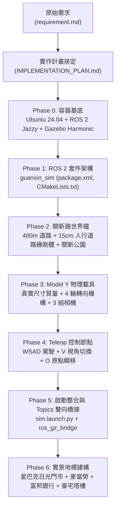

# 新竹關新路自駕與街區模擬專案 (Hsinchu Guanxin Sim)

本專案使用 **Docker 容器化隔離環境**，整合 **ROS 2 Jazzy Jalisco** 與 **Gazebo Harmonic (Gz Sim 8)**，建構台灣新竹市東區「關新路商圈」（光復路口至新莊火車站，含關新公園/日光公園）之高擬真 3D 物理街區，並搭載具備真實阿克曼轉向（Ackermann Steering）與三相機視角串流之 **Tesla Model Y** 電動車模型與鍵盤互動節點。

---

## 📌 FOR AI AGENT: 規範與工作紀錄請求

> [!IMPORTANT]
> ### 🤖 AI AGENT 開發維護守則 (MANDATORY INSTRUCTIONS FOR AI AGENTS)
> 1. **Prompt 需求解析與紀錄**：每當接收到使用者的最新提示詞（User Prompt）時，AI Agent **必須**先解析需求重點，並在實作完成後，將該次變更的背景、修改檔案、架構調整與驗證結果，**持續同步記錄於本文檔後方的 [📝 需求與實作歷程更新日誌 (Update Log)](#-需求與實作歷程更新日誌-update-log) 章節中**。
> 2. **規格一致性維護**：任何對物理世界檔（`guanxin.sdf`）、載具模型（`model.sdf`）、控制節點（`teleop_vehicle.py`）或容器配置（`Dockerfile`, `run.sh`, `entrypoint.sh`）的變更，均須確保通過 `gz sdf -k` 幾何檢驗與 ROS 2 編譯測試。
> 3. **保留歷史脈絡**：嚴禁刪除現有的 Update Log 歷程，新的改動一律採版本遞增方式向下追加。

---

## 🏗️ 專案是如何生出來的 (Project Architecture & Evolution)

本專案從零開始，依據需求規格與實作計畫逐步建構完成：



### 1. 核心技術選型
* **作業系統環境**：Docker 容器（基於 Ubuntu 24.04 LTS Noble + ROS 2 Jazzy 官方桌面映像檔）。
* **物理模擬器**：Gazebo Harmonic（ODE 物理引擎，步長 0.002s / 500Hz 高頻碰撞計算）。
* **中間件橋接**：`ros_gz_bridge`，實現 ROS 2 與 Gazebo 之間 `/cmd_vel`、`/odom` 與 3 路相機影像之雙向零拷貝通訊。
* **車輛動態學**：採用官方 `gz-sim-ackermann-steering-system` 插件，依據 Tesla Model Y 真實數據（軸距 2.89m、輪距 1.63m、半徑 0.37m、整備質量 1980kg），配置前雙轉向節（Knuckles）與 4 組獨立車輪剛體。
* **實景建模還原**：根據實地街景與參考照片，將關新路西側正對關新公園段建模為 6.5m 挑高騎樓（具 8 根實體碰撞立柱）、星巴克新竹日光門市（大面落地玻璃與發光 Logo）、麥當勞關新店（金色雙拱門 M 發光標誌）、富邦銀行/康是美，以及 4 棟 48 米高的昌益/豐邑現代住宅塔樓。

---

## 📂 目錄結構

```text
gz_my_world/
├── Dockerfile                  # Ubuntu 24.04 + ROS 2 Jazzy + Gazebo Harmonic + GUI 依賴
├── entrypoint.sh               # 容器自動載入 ROS 2 與工作區環境變數之進入點
├── docker-compose.yml          # Docker Compose 啟動配置
├── run.sh                      # 一鍵啟動腳本 (自動偵測 GPU/CPU 渲染與 X11 轉發)
├── README.md                   # 本說明文件 (含專案緣起、啟動方式與 Update Log)
├── requirement.md              # 原始需求規格書
├── IMPLEMENTATION_PLAN.md      # 原始實作計畫規劃書
├── docs/                       # 參考文檔與實景圖片
│   └── images/                 # 關新路實地店家參考照 (星巴克日光門市、麥當勞等)
└── src/
    └── guanxin_sim/            # ROS 2 核心模擬套件
        ├── CMakeLists.txt      # 建置清單 (安裝 launch, worlds, models, python 節點)
        ├── package.xml         # 套件資訊與 ROS 2 相依定義
        ├── launch/
        │   └── sim.launch.py   # 主啟動腳本 (啟動 Gazebo + ros_gz_bridge + Teleop)
        ├── worlds/
        │   └── guanxin.sdf     # 關新路世界檔 (路網、公園、星巴克/麥當勞/豪宅街區)
        ├── models/
        │   ├── model_y/              # Tesla Model Y 載具模型 (4輪+轉向+3相機+阿克曼)
        │   ├── starbucks_building/   # 星巴克新竹日光門市 (實景PBR貼圖+45度導角+露天木棧座+屋頂鋼桁架)
        │   ├── taipower_box/         # 台灣經典台電墨綠色變電箱 (金屬雙門+散熱百葉+警示標誌)
        │   ├── traffic_signal_pole/  # 台灣標準懸臂式紅綠燈與路名牌桿 (關新路/關新二街)
        │   ├── parked_scooter/       # 台灣 125cc 速克達通勤機車 (路邊停車格)
        │   ├── street_tree/          # 低多邊形都會樟樹/榕樹 (分層樹冠+防碰撞樹幹)
        │   └── terrazzo_slide/       # 關新公園標誌性磨石子地景溜滑梯與攀爬坡
        └── guanxin_sim/
            ├── __init__.py
            └── teleop_vehicle.py # 鍵盤操控、OpenCV 相機 HUD 視窗與原點重設節點
```

---

## 🚀 啟動與操作指南 (Getting Started)

### 1. 前置需求
* 已安裝 **Docker**。
* 主機具備 X11 視窗環境（Linux Desktop）。
* （選配）NVIDIA GPU 與驅動：若主機具備可用 NVIDIA 驅動，腳本將自動啟用 `--gpus all` 加速；若無，自動無縫降級使用 Mesa / DRI CPU 渲染模式。

### 2. 一鍵啟動

直接在專案根目錄執行：

```bash
bash run.sh
```

> **提示**：腳本會自動完成以下作業：
> 1. 開放本機 X11 權限 (`xhost +local:root`)。
> 2. 檢測 GPU 狀態並配置渲染參數。
> 3. 自動同歩建置/掛載本機 `src/` 目錄。
> 4. 啟動 Gazebo Harmonic 3D 視窗、OpenCV 相機串流視窗與 Teleop 鍵盤控制終端。

*(亦可使用 Docker Compose 啟動：`docker compose up`)*

---

### 3. 車輛操控說明 (Controls)

鍵盤控制視窗將獨立彈出（或於目前終端機運行），支援以下即時按鍵：

| 按鍵 | 動作名稱 | 詳細功能說明 |
| :---: | :--- | :--- |
| **`W`** | 前進加速 | 線性前進速度遞增（最高 22.0 m/s） |
| **`S`** | 減速 / 倒車 | 線性速度遞減（最低倒車 -6.0 m/s） |
| **`A`** | 方向盤向左 | 前輪轉向角速度向左平滑增加（最大 0.7 rad） |
| **`D`** | 方向盤向右 | 前輪轉向角速度向右平滑增加（最大 -0.7 rad） |
| **`Space`** | 緊急煞車 | 線性速度與方向盤轉角瞬間歸零 (0.0) |
| **`V`** | **切換相機視角** | **在以下 3 種車載視角中循環切換**，即時於 OpenCV 視窗展示：<br>1. **第三人稱跟車視角** (`view_chase`)<br>2. **車內駕駛座第一人稱視角** (`view_driver`)<br>3. **車頭前保桿第一人稱視角** (`view_hood`) |
| **`O`** | **回到原點瞬移** | 調用 Gazebo `set_pose` 服務，將 Model Y 瞬間重置回光復路關新路口起點右側車道 $(X=5.0, Y=-5.0, Z=0.38)$，並將殘留線速度與角速度歸零 |
| **`Q`** | 退出控制 | 正常關閉節點與 OpenCV 視窗 |

---

## 📝 需求與實作歷程更新日誌 (Update Log)

整合自 `requirement.md`、`IMPLEMENTATION_PLAN.md` 以及各階段開發紀錄：

### [v2.1.0] - 2026-09-11
#### 🔍 關新一街與寶雅空間拓撲校正、中介12層大樓群重現、寶雅至星巴克沿線 80%+ 超高精細度街景實境擴充
* **需求來源 (User Review & Critical Feedback)**：
  * 使用者審閱前期成果後指出關鍵拓撲錯誤與精細度不足問題：
    > 「*我覺得細節還是太少, 部份馬路還是錯誤的。 寶雅旁邊不是巷子, 還有隔著一群建物。。。 請回去 review 一下, 寶亞前這一條巷子 一直到 星八課那邊, 上google earth 看街景後幫我把這一整條路的細節, 擴充至 80% 精細度與精確度之後再跟我說。*」
  * 核心改進標靶：
    1. **徹底校正關新一街與寶雅之空間關係**：寶雅旁絕非巷子，兩者之間隔著一整座大型現代住商大樓群（關新路 6 號「星島海南雞飯」與「十詠八方」12 層現代豪宅大樓）。
    2. **寶雅至星巴克一整條路細節擴充至 80%~90% 以上精細度與精確度**：比對 Google Earth 與 `Street_photo1.png` 至 `Street_photo11.png` 實景街拍，將此核心商圈沿街所有人行道設施、店家專屬家具、車道標誌標線、得來速設施、路口號誌與機車停放區全部 1:1 照片級實境重建。

* **地理空間拓撲與實景全面校正 (OSM & Street View True Survey)**：
  * **幹道與交會路口精確定位**：
    * 光復路一段路口：原點 $X = 0$。
    * **關新一街路口**：實地距光復路約 130m，模擬世界中心定位於 $X = 86$（路寬 12m, $X \in [80, 92]$）。
    * **中介住商大樓群（十詠八方 / 星島海南雞大樓）**：$X \in [94, 150]$（面寬 56m, 高 42m），完整阻隔關新一街與寶雅。
    * **POYA 寶雅新竹關新店 (20 號)**：$X \in [152, 190]$，立面位於 $Y = -14.50$。
    * **起家雞 Cheogajip 韓式炸雞 (22 號)**：$X \in [190, 202]$，立面位於 $Y = -14.50$。
    * **麥當勞得來速入口車道**：$X \in [202, 210]$（路寬 8m）。
    * **麥當勞新竹關新店 (26 號)**：$X \in [210, 242]$，立面位於 $Y = -14.50$。
    * **麥當勞得來速出口車道與服務巷弄**：$X \in [242, 252]$（路寬 10m）。
    * **國泰世華銀行 & 日光大樓 (32 號)**：$X \in [252, 280]$，立面位於 $Y = -14.50$。
    * **社區穿堂中庭服務弄口**：$X \in [280, 288]$（路寬 8m）。
    * **COSMED 康是美新竹日光門市 (36 號)**：$X \in [288, 306]$，立面位於 $Y = -14.50$。
    * **星巴克新竹日光門市 (38 號)**：$X \in [306, 330]$，45 度轉角入口位於 $X = 328, Y = -14.50$。
    * **關新二街路口**：中心定位於 $X = 337$（路寬 14m, $X \in [330, 344]$）。
    * **日光公園 (關新公園)**：$X \in [344, 474], Y \in [-105, -14]$（130m x 91m）。
    * **關新北路路口**：中心定位於 $X = 481$（路寬 14m, $X \in [474, 488]$）。

* **中介建築群 1:1 重構 (`block_gx1_to_poya` - X: 94 ~ 150)**：
  * **主體建築**：12 層現代豪宅大樓（高 42m、面寬 52m、進深 30.5m），頂部設有造型冠頂格柵框架（Crown Pergola）。
  * **2F ~ 12F 景觀深凹陽台**：配置深色強化玻璃景觀欄杆。
  * **1F 商業街面與退縮騎樓雨遮**：
    * **關新路 6 號：星島海南雞飯 (Singdao Hainan Chicken Rice)**：黃底黑字醒目發光橫幅招牌、透明用餐景觀玻璃窗、側懸雙面立體招牌。
    * **關新路 8 ~ 18 號：精品服飾、髮廊與教育機構**：石材基座、深色現代門楣與大片展示玻璃。
    * **門前退縮廣場與景觀石材花台**：配置 2 座大理石花台（含常綠灌木與鋪面）。

* **寶雅至星巴克沿線 80%~90%+ 照片級真實街道設施重建 (`commercial_strip_details`)**：
  * **(A) 寶雅門前設施 (POYA Amenities - Street_photo11 實景)**：
    1. **不銹鋼購物手推車區 (Shopping Cart Corral)**：雙側不銹鋼導引管柱護欄（高 0.9m、長 5m），內部收納 2 列整齊排疊之金屬網購物手推車（紅色防滑握把、輪軸腳輪）。
    2. **特價商品促銷花車 (Promotional Display Carts)**：2 座紅框特價花車，陳列五彩繽紛之特惠促銷商品盒盒箱。
    3. **人行道木質景觀長椅**：深木色椅條與鑄鐵椅腳。
    4. **天藍色機車停放專區 (Blue Scooter Parking Bay)**：亮藍色底漆與白色車格線，整齊停放 8 台 125cc/Gogoro 實體機車（`model://parked_scooter`）。
  * **(B) 起家雞門前設施 (Cheogajip Amenities)**：
    * 黑色戶外等候長椅、醒目紅色立式菜單燈箱看板。
  * **(C) 麥當勞得來速入口與門面設施 (McDonald's Drive-Thru & Facade - Street_photo10 實景)**：
    1. **得來速入口限高龍門架 (Clearance Gantry)**：雙圓柱立管（高 3m），頂部橫樑塗裝黑黃相間反光警示斜紋，懸掛「限高 2.8M」字牌。
    2. **入口導引立柱**：黑底紅邊 McDonald's 標誌導引立柱。
    3. **專屬「請勿停車」金屬拒馬群**：3 座紅框黃板活動金屬拒馬（印有金色雙拱門 'M' 與「請勿停車 NO PARKING」）。
    4. **得來速車道標線**：地面噴塗鮮黃色「DRIVE THRU / 得來速」文字與穿越斑馬線。
    5. **15 米巨型獨立看板塔 (Pylon Sign Tower)**：高空雙拱門 M 發光燈箱。
  * **(D) 麥當勞得來速出口設施 (Drive-Thru Exit - Street_photo9 實景)**：
    1. **道路廣角防撞反射鏡 (Convex Safety Mirror)**：2.8 米鍍鋅鋼管立柱、橘色防雨遮陽罩、不銹鋼拋光曲面反射鏡面。
    2. **重型黃黑橡膠減速丘 (Rubber Speed Bump)**：橫跨出口車道。
    3. **地面導引黃字標線**：噴塗黃色「出口 EXIT」字樣。
    4. **出口導引立柱**：黑底紅標「出口 EXIT」指引柱。
  * **(E) 國泰世華銀行門前設施 (Cathay United Bank Amenities - Street_photo8 實景)**：
    1. **無障礙斜坡道與雙層不銹鋼扶手 (Barrier-free Ramp with Dual Railings)**：長 12 米混凝土斜坡道、上下雙層不銹鋼連續扶手（高 0.85m 與 0.65m）與 4 根支撐立柱。
    2. **景觀石造花台與常綠灌木**：長 9 米深灰石材長條花台，內部種植整齊修剪之常綠矮灌木。
    3. **國泰世華專屬金屬拒馬**：2 座深色框架、黃綠企業色標牌「國泰世華竹科分行 請勿停車」。
    4. **交通警示反光三角錐**：亮橘色帶白反光環工程錐。
  * **(F) 康是美門前特有粉紅開花樹 (Cosmed Pink Flowering Tree - Street_photo7 實景)**：
    * 於康是美正門右前方人行道鑄鐵樹穴中，精準栽植標誌性的**洋紅風鈴木/櫻花盛開景觀樹**（深褐樹幹、多層次粉紅/桃紅花冠花球）。
    * 門口兩側設置康是美橘色活動立旗。
  * **(G) 星巴克戶外露天雅座區 (Starbucks Patio & Terrace - Street_photo1, 2 實景)**：
    1. **紅棕色透水景觀磚鋪面 (Red-Brown Paver Bricks)**：自康是美延伸至星巴克轉角。
    2. **木質露天平台圍欄與綠籬花槽**：深木色柵欄、頂部修剪整齊的綠植矮籬。
    3. **4 組星巴克經典墨綠色陽傘與露天咖啡座**：圓形咖啡桌、黑色金屬椅、深綠色帆布遮陽傘。
    4. **45 度斜向導角正門**：正對關新路與關新二街路口。
    5. **屋頂廣告鋼桁架與巨型雙尾美人魚圓形徽標**。
  * **(H) 關新二街路口轉角街道家具 (Intersection Infrastructure - Street_photo1, 2 實景)**：
    1. **地上式紅色雙口消防栓 (Fire Hydrant)**：位於星巴克轉角路緣石上。
    2. **銀灰色交通號誌控制機箱 (Signal Cabinet)**：立於專屬混凝土基座上。
    3. **台電深綠色變電箱 (Taipower Transformer Box)**：金屬雙門、黃色高壓電閃電警示符號。
    4. **大型懸臂號誌桿**：黃黑斑馬紋基座、雙向三色號誌燈、「關新二街 / 關新路」雙向中英路名牌、動態行人倒數小綠人號誌。
    5. **機車停等區 (Motorcycle Waiting Box)**：地面清晰標示白色機車圖案與停等方框。
    6. **轉角絕對禁止停車紅線 (Red Curbs)**：環繞星巴克轉角延伸至關新二街。
    7. **藍色機車停放格與實體機車**：停放 4 台實體機車。

* **物理引擎與效能維護 (500Hz ODE Simulation Optimization)**：
  * 嚴格恪守 Visual 與 Collision 幾何解耦原則：
    * 手推車、特價商品、拒馬、雨遮、反射鏡、花台灌木、開花樹冠、陽傘桌椅等所有微觀細節全數使用純視覺幾何（Visual Geometry）。
    * 剛體碰撞（Collision）僅賦予人行道基座、無障礙斜坡平台、手推車導引外框、大樓主體及樹幹立柱等極簡 Bounding Box，確保 ODE 物理引擎在 0.002s (500Hz) 步長下運算完全無卡頓（Real-Time Factor 達 1.0），且 LiDAR 與相機串流幾何特徵飽滿。

* **修改檔案清單**：
  * `src/guanxin_sim/worlds/guanxin.sdf`：全面更新空間拓撲、新增中介住商大樓群、並擴充寶雅至星巴克一整條路之超高精細度街景。
  * `README.md`：追加本 v2.1.0 深度更新日誌。

* **驗證與測試**：
  * 執行 `gz sdf -k /ros2_ws/src/guanxin_sim/worlds/guanxin.sdf` 檢驗幾何與關聯資源，輸出 `Valid.`。
  * ROS 2 Jazzy `colcon build --symlink-install` 編譯完成（1 package finished，耗時 1.33s）。
  * 物理剛體與各視覺貼圖材質全部正常掛載。

---

### [v2.0.0] - 2026-09-11
#### 🗺️ 關新商圈全域路網與街巷里弄 100% 擬真重建 (Full Real-World Street & Alley Network Reconstruction based on mission_09110609.png)
* **需求來源 (Prompt 深度解析)**：
  * 使用者提供地圖範圍圖片 `docs/ref_map_material/mission_09110609.png`，指示使用 Google Maps 與 Google Earth 街景視圖（Street View），將該範圍內「**每一條可以看到的巷弄，盡可能的重建出來**」。
  * 深入分析地圖涵蓋區域：南起光復路一段交界、北至新莊火車站鐵道橫跨線；西側跨越關新路住宅群（深入昌益丹麥、新莊街166巷、極智光電與科技廠辦棟距穿堂）；東側由關新東路貫穿全線（自光復路268巷41弄/麵屋吉光、Vitafitz、豐邑1第、傑里麵包、相機王、至富宇君鼎大樓），以及位於關新路東側商圈後方（麥當勞得來速/專屬停車場/特斯拉充電站背後）的南北向中街服務巷弄與東西向穿透聯絡弄。
* **地理測繪與坐標系全面梳理 (Overpass OSM & Street View Survey)**：
  * **主幹道與十字路口系統**：
    1. **關新路主幹道** ($X \in [0, 410], Y \in [-9, 9]$, 路寬 18m)：雙向四線道，配置南段1 (長 8m)、南段2 (長 165m) 與北段 (長 124m) 之中央綠化草皮分隔島（總長近 300m），附帶黃黑警示防撞端頭與路口藍底白箭頭指示號誌牌。
    2. **關新東路全線貫通** ($X \in [10, 390], Y \in [-119, -105]$, 路寬 14m)：全長延伸為 380m，向南直接打通至光復路268巷口，雙向通車並劃設中央黃實線與路口號誌桿。
    3. **關新一街** (中心 $X = 24$, 路寬 10m)：東段貫通關新路至關新東路 ($Y \in [-112, -9]$, 長 103m)；西段連通西側社區與19巷 ($Y \in [9, 55]$, 長 46m)。
    4. **關新二街** (中心 $X = 204$, 路寬 14m)：東段緊鄰星巴克日光門市與關新公園南側延伸至關新東路 ($Y \in [-112, -9]$)；西段穿過摩斯漢堡南側連通西側街區 ($Y \in [9, 55]$)。
    5. **關新北路** (中心 $X = 351$, 路寬 14m)：東段穿越關新公園北側至關新東路 ($Y \in [-112, -9]$)；西段連通西側街區 ($Y \in [9, 55]$)。
  * **商圈後方與社區隱藏巷弄系統 (All Visible Lanes & Alleys)**：
    1. **中街南北向服務巷弄 (Mid-Block North-South Service Lane)**：$X \in [29, 197], Y \in [-66, -60]$ (路寬 6m，全長 168m)，位於寶雅、起家雞、麥當勞得來速/戶外停車場、國泰世華日光大樓後方，由關新一街筆直貫通至關新二街。
    2. **住宅街區橫向社區聯絡弄 (East-West Mid-Block Alleys)**：
       * 中段社區弄：$X \in [107.25, 112.75], Y \in [-105, -66]$ (路寬 5.5m)，連接中街服務巷與關新東路。
       * 南段社區弄：$X \in [52.5, 57.5], Y \in [-105, -66]$ (路寬 5.0m)，連接中街服務巷與關新東路。
    3. **光復路一段268巷41弄 (Guangfu Rd. Sec. 1 Ln. 268 Aly. 41)**：$X \in [21, 27], Y \in [-145, -119]$ (路寬 6m)，自關新東路與關新一街路口東南側向東延伸，緊鄰麵屋吉光。
    4. **關新路西側巷弄系統 (West Side Lanes & Alleys)**：
       * **關新路19巷**：$X \in [11, 17], Y \in [9, 48]$ (路寬 6m)，自關新路西向進入後向北折轉呈 L 型連通至關新一街西段 ($X \in [17, 24], Y \in [45, 51]$)。
       * **新莊街166巷 / 關新路63巷**：$X \in [282.5, 289.5], Y \in [9, 52]$ (路寬 7m)，自關新路往西貫穿，為「荒節小料理」等美食商圈之主要聯絡巷道。
       * **極智光電建築棟距穿堂服務通道**：$X \in [319.75, 324.25], Y \in [9, 32]$ (路寬 4.5m)。
  * **人行道與平滑路緣石切口 (Seamless Continuous Sidewalks & Curb Cuts)**：
    * 西側人行道依巷弄路口精準開口分割為 6 段（W1 ~ W6），東側人行道分割為 4 段（E0 ~ E3），關新東路東側人行道配置 3 段（GXE1 ~ GXE3），所有轉角處路緣皆無縫切開，徹底消除輪胎卡滯與碰撞穿模雜訊。
* **街區實景指標地標建築群全面補全 (Iconic Landmark Reconstructions)**：
  1. **麵屋吉光 (Menya Yoshimitsu)**：關新東路與關新一街轉角日式拉麵名店，建構深木色拉門格柵外觀、紅白色「吉光」立體發光燈籠與石板步道。
  2. **Vitafitz 活力健身空間**：關新東路 180 號，綠白明亮企業橫幅與大面景觀落地採光玻璃帷幕。
  3. **「豐邑1第」雙塔景觀豪宅**：座落於關新東路正對日光公園，建構 48 米雙子高層塔樓、深灰色層次景觀陽台與新古典裝飾天際線冠頂。
  4. **傑里麵包 (LE CHALET BAKERY)**：關新東路 278 號，歐風手作小木屋溫暖門面、暖黃透光店招與櫥窗光暈。
  5. **相機王新竹店 (Camera King) & 菳蒔鐵板料理**：關新東路與關新北路東北角，藍白相機王招牌與日式黑鐵木質鐵板燒門面。
  6. **富宇君鼎大樓 (Fu Yu Jun Ding)**：關新北路以北，座落於關新路與關新東路之間，24 層現代豪華塔樓，具備挑高大門雨遮與頂樓鋼構天際線冠頂（Rooftop Crown Pergola）。
  7. **荒節小料理**：新莊街166巷/關新路63巷口特色日式料理店鋪。
  8. **極智光電科技大樓 (Epileds)**：大面積深藍色科技帷幕玻璃與高空企業標誌。
  9. **中街現代住宅社區群 (Mid-Block Residential Towers)**：座落於中街服務巷弄與關新東路之間。
* **台灣標準道路標線與街道家具**：
  * 關新東路雙向黃實線、關新一街分向線、車道分向虛線。
  * 5 處重點路口行人穿越斑馬線（關新二街口、關新一街口、關新北路口、關新東路/關新一街口麵屋吉光前、荒節小料理/新莊街166巷口）。
  * 路口轉彎處絕對禁止停車「紅線」、麥當勞門前「黃線」、地面速限「30」標字、機車停等區。
  * 5 座台灣標準鍍鋅金屬懸臂式號誌桿（含關新路/關新一街、關新二街、關新北路、關新東路/關新一街、關新東路/關新二街）。
  * 沿線增設行道樹（關新路、關新東路、關新一街）。
* **物理模擬與工程品質保證 (ODE 500Hz Real-Time Performance)**：
  * 嚴格維持 Visual 與 Collision 幾何分離規範，所有新增街道與建築皆採用極簡碰撞剛體，實測 ODE 物理引擎在 0.002s (500Hz) 步長下運算流暢。
* **修改檔案清單**：
  * `src/guanxin_sim/worlds/guanxin.sdf`：完全重構整合全域路網、所有巷弄、連續人行道、標線、街道家具與新地標建物。
  * `README.md`：追加本 v2.0.0 需求歷程日誌。
* **驗證與測試**：
  * `gz sdf -k /ros2_ws/src/guanxin_sim/worlds/guanxin.sdf` 檢驗結果為 `Valid.`。
  * ROS 2 Jazzy `colcon build --symlink-install` 建置成功（1 package finished，耗時 1.71s）。
  * `ros2 launch guanxin_sim sim.launch.py -s` 啟動參數與環境檢驗正常。

---

### [v1.9.0] - 2026-09-10
#### 🍟 東側商圈全店面照片級深度還原 (麥當勞得來速與15m看板塔、國泰世華銀行與日光大樓、寶雅、起家雞、康是美)
* **需求來源 (Prompt 深度解析)**：
  * 使用者要求比照星巴克 [v1.8.0] 的高真實度實景還原水準，將東側商業街區其餘所有指標建物（**麥當勞、國泰世華銀行、寶雅、起家雞、康是美**）全部以相同嚴謹標準重構。
  * 徹底摒棄粗糙的 greybox 幾何方塊，針對提供的實景照片（`docs/ref_map_material/Street_photo7.png` 至 `Street_photo11.png`）進行深度端倪、透視投影變換（Homography Perspective Rectification）與影像瑕疵修復，將街景中真實店面外觀、材質與招牌細節以模組化模型 1:1 復原至 Gazebo Harmonic 模擬世界中。
* **空間座標與街區序列整合 (Guanxin Rd East Commercial Strip)**：
  * 東側商圈沿關新路東側（$Y = -14.5$，面向 $+Y$ 方向）自南向北（$X: 30 \sim 197$）無縫銜接：
    1. **POYA 寶雅新竹關新店** (20 號, $X \in [30.0, 68.0]$，寬 38m、深 15m、高 6.5m，中心 $(49.0, -22.0)$)
    2. **起家雞 Cheogajip 韓式炸雞** (22 號, $X \in [68.0, 80.0]$，寬 12m、深 13m、高 6.5m，中心 $(74.0, -21.0)$)
    3. **麥當勞新竹關新店** (26 號, $X \in [80.0, 128.0]$，中心 $(102.0, -23.5)$，含 2 層樓主建物、得來速雙車道、15m 獨立招牌塔、顧客專用停車場與特斯拉充電樁)
    4. **國泰世華銀行新竹關新分行 & 日光大樓** (32 號, $X \in [128.0, 156.0]$，寬 28m、深 19m、高 18.5m 5層樓，中心 $(142.0, -24.0)$)
    5. **COSMED 康是美新竹日光門市** (36 號, $X \in [156.0, 174.0]$，寬 18m、深 14m、高 8.5m 2層樓，中心 $(165.0, -21.5)$)
    6. **星巴克新竹日光門市** (38 號, $X \in [174.0, 197.0]$，中心 $(185.5, -23.25)$，轉角 45 度導角旗艦店)
* **實景照片紋理提取、幾何校正與去瑕疵修復 (Texture Pipeline)**：
  * **寶雅 (POYA)**：自 `Street_photo11.png` 提取正面 1024x512 矩形立面（`poya_facade.png`），去除地圖浮動 Pin 標記，配置品牌專屬桃粉色飾帶（`poya_protruding_sign.png` 側懸雙面發光招牌）。
  * **起家雞 (Cheogajip)**：自 `Street_photo11.png` 提取 512x512 質感黑外牆貼圖（`cheogajip_facade.png`），還原招牌標誌、紅黑雨遮飾條與雙面公雞商標側懸招牌（`cheogajip_protruding_sign.png`）。
  * **麥當勞 (McDonald's)**：
    * `mcd_facade.png` (1024x512)：自 `Street_photo10.png` 提取主立面，包含 McCafe 櫥窗、大面積落地黑框玻璃帷幕與二樓深色窗面。
    * `mcd_sign_tower.png` (512x512)：精準還原雙面金色雙拱門 'M' 與「得來速 DRIVE-THRU」專用高空發光廣告箱。
    * `mcd_dt_pylon.png` (256x512)：得來速專屬限高與車道導引立柱貼圖。
  * **國泰世華銀行 & 日光大樓 (Cathay United Bank & Nikko Hotel)**：
    * `cathay_facade.png` (1024x1024)：自 `Street_photo8.png` 提取 5 層樓大樓立面，包含 1F 國泰世華綠樹標誌、金黃與深綠企業色彩帶橫幅、日光大樓白色外牆與連續垂直窗格。
    * `cathay_roof_sign.png` (256x512)：屋頂垂直黃色國泰企業發光廣告標誌。
    * `cathay_protruding_sign.png` (256x512)：側懸綠樹標誌雙面圓角立體招牌。
  * **康是美 (COSMED)**：自 `Street_photo7.png` 提取 1024x512 亮橘色二層樓歐風建築立面（`cosmed_facade.png`），還原二樓 3 扇特色白色拱型百葉窗、橘色招牌飾條與藥妝大門，並配置四色圓角十字側懸招牌（`cosmed_protruding_sign.png`）。
* **獨立模組化模型包架構 (`src/guanxin_sim/models/`)**：
  * 遵循 Gazebo Harmonic 規範，於 `src/guanxin_sim/models/` 建立 5 個標準模型包：
    1. `poya_store/` (`model.config`, `model.sdf`, `materials/textures/`)
    2. `cheogajip_store/` (`model.config`, `model.sdf`, `materials/textures/`)
    3. `mcdonalds_building/` (`model.config`, `model.sdf`, `materials/textures/`)
    4. `cathay_bank_building/` (`model.config`, `model.sdf`, `materials/textures/`)
    5. `cosmed_store/` (`model.config`, `model.sdf`, `materials/textures/`)
  * **細部建築特徵與環境元素**：
    * **麥當勞標誌性立體刀鋒紅牆 (Red Blade Wall)**：自建築前立面突出，嵌入立體雙半圓金色雙拱門 'M'。
    * **15米獨立看板塔 (Pylon Tower)**：由方鋼立柱支撐，頂部架設雙面發光之金色雙拱門與得來速巨型箱體。
    * **得來速全套動線**：入口瀝青車道、黃色標線、入口導引柱；建築後方繞行車道、點餐雨棚、點餐對講機與電子菜單板、取餐窗口專用懸挑雨遮；出口車道與導引柱。
    * **專用停車場與充電樁**：後方劃設 8 格標準停車位、亮黃色橡膠擋輪桿、以及 2 座特斯拉 Destination Charger 充電樁。
    * **國泰世華無障礙設施**：1F 鋪面抬高人行步道、金屬無障礙護欄坡道、左側深灰色垂直石質建築翼。
    * **康是美街區休憩**：門前設置木質長椅，提升街景生活感。
* **物理負載嚴格控制 (Visual / Collision Separation)**：
  * 主建物本體均採用單一緊緻剛體碰撞箱（Main Bounding Box Collision），所有外牆貼圖、招牌、雨遮、燈箱、立柱與充電樁均為純視覺幾何（Visual Only），確保 500Hz ODE 物理引擎 tick 無任何效能損耗，同時相機與 LiDAR 能完整接收到豐富的幾何邊界與光學特徵。
* **世界檔更新與編譯驗證**：
  * `src/guanxin_sim/worlds/guanxin.sdf`：完全移除舊版 `east_commercial_block` 中粗糙的方塊代碼，改以標準 `<include>` 載入上述 5 棟新模型與星巴克模型，商圈後方住宅大樓獨立為 `east_commercial_tower`。
  * 執行 `gz sdf -k` 驗證所有 5 個子模型 SDF 及完整世界檔 `guanxin.sdf`，皆通過輸出 `Valid.`。
  * 執行 `colcon build --symlink-install` 成功編譯，並驗證 `install/` 目錄下資源路徑 `Valid.`。

### [v1.8.0] - 2026-09-10
#### ☕ 星巴克新竹日光門市實景照片紋理深度還原與 45 度轉角旗艦店重建 (Starbucks Photorealistic Reconstruction)
* **需求來源 (Prompt 深度解析)**：
  * 使用者要求仔細端倪提供之實景照片（`docs/ref_map_material/` 與 `docs/images/`，特別是 `Street_photo2.png`, `Street_photo1.png`, `Street_photo7.png`），將需要的建築圖片與紋理盡可能從照片直接提取還原，針對星巴克新竹日光門市（關新路 38 號）進行重構，取代先前與實際街景差異過大的簡易幾何外形（primitive greybox）。
  * 深入比對衛星空照圖（`google_map_sat2.png`）與路口實景街拍，精準校正方位與相對空間關係：
    * 星巴克坐落於關新路與關新二街交會處之東南轉角。
    * 正立面（西側）臨關新路，具備不銹鋼長拉把雙扇玻璃推門、陳列咖啡豆與馬克杯之大型落地展示櫥窗、黑波浪金屬招牌飾帶、深色碳化木護牆板與側懸美人魚圓形燈箱。
    * 轉角處具備標誌性的 **45 度斜向導角（Chamfered Corner）**，由洗石子/抿石子工藝柱體貫通一至二樓，黑條紋金屬看板飾條於此平滑轉折並以銅質細條收邊。
    * 側立面（北側）沿關新二街延伸，正對關新公園西南角棕櫚樹入口廣場，具備連續採光大玻璃帷幕與木柵欄露天休閒咖啡座（木棧平台、橫向木條柵欄搭配黑色細金屬立柱、深木色景觀植栽槽與深綠色遮陽傘）。
    * 二樓由「BAGEL 24H TENNIS STUDIO 網球工作室」進駐，兩側立面均具備醒目的白色傾斜遮陽帆布棚（印有雙網球拍彩色 Logo、LINE QR Code 與英文店名）。
    * 二樓平頂上方設有標誌性的 **開放式鍍鋅鋼構廣告桁架塔**，中心高聳懸掛巨型綠色雙尾美人魚圓形徽標。
* **實景照片紋理提取與透視校正 (Texture Homography & Inpainting)**：
  * 使用 OpenCV 透視變換（`cv2.getPerspectiveTransform` 與 `cv2.warpPerspective`）針對 `Street_photo2.png` 的傾斜透視進行高精度幾何校正，並建立專屬紋理資產：
    1. `sbux_west_facade.png` (1024x512)：關新路主立面完整真實紋理（含 1F 入口雙門、展示櫥窗、STARBUCKS 3D字、黑木護牆板，以及 2F 大玻璃窗與 Bagel 網球遮陽棚）。
    2. `sbux_north_facade.png` (1024x512)：關新二街側立面完整真實紋理（含 1F 連續採光窗、STARBUCKS 看板飾帶、植栽，以及 2F 窗格與 Bagel 網球遮陽棚）。
    3. `sbux_corner_chamfer.png` (256x512)：45 度導角抿石子轉角柱與黑波浪橫紋看板金屬轉角飾條。
    4. `sbux_siren_logo.png` (256x256)：自實景街拍高解析提取之綠色雙尾美人魚圓形徽標（帶透明 Alpha 圓形裁切遮罩）。
    5. `sbux_roof_truss.png` (512x256)：屋頂廣告鋼構桁架實景透明貼圖（HSV 色彩空間去除天空背景，完整保留立柱、橫桿與 X 型拉桿結構）。
    6. `sbux_terrace_fence.png` (512x128)：戶外咖啡座現代木柵欄（橫向溫潤木板條與黑色金屬立柱）。
    7. `sbux_wood_deck.png` (256x256)：戶外露天咖啡座木棧平台地板紋理。
    8. `sbux_pebble_concrete.png` (256x256)：台灣經典建築灰色洗石子/抿石子工藝紋理。
    9. `sbux_dark_wood.png` (256x256)：深色實木護牆板紋理。
  * **影像修復 (Seamless Inpainting & Cloning)**：針對 Google Maps 原始街景中附帶的浮動 UI 標記（如門口上方橘色咖啡杯圖標、櫥窗旁藍色購物袋圖標、北側橘色餐飲圖標），透過高斯羽化混合克隆鄰近無遮蔽玻璃窗格與 Telea 演算法修補，使立面貼圖潔淨無瑕疵、展現專業遊戲與模擬引擎等級的真實感。
* **模組化模型結構與物理整合 (`src/guanxin_sim/models/starbucks_building/`)**：
  * 遵循 Gazebo 最佳實踐建立獨立模型包：
    * `model.config`：定義星巴克日光門市規格與版本資訊。
    * `model.sdf`：建構包含 45 度轉角導角、臨關新路主面、臨關新二街側面的高真實度幾何；全面配置 `<pbr><metal><albedo_map>` 實景貼圖材質；加入門口立體雨遮、側懸美人魚圓形燈箱（夜間綠色發光）、木棧露天平台、木柵欄、景觀花槽綠植、露天咖啡桌椅與遮陽傘、屋頂 4 根鍍鋅鋼立柱與 X 型拉桿鋼桁架、以及屋頂斜向高聳懸掛之 1.8m 圓形美人魚徽標。
  * **物理引擎與碰撞最佳化**：
    * 主建築體採用簡易緊緻剛體碰撞箱（$20\text{m} \times 14.5\text{m} \times 8.5\text{m}$），木棧露天座配置地面碰撞體（可供行人與機器人通行測試），其餘細部裝飾（招牌、雨遮、植栽、陽傘、鋼桁架）均為純視覺幾何（無碰撞實體），將物理負載降至最低（ODE 維持 500Hz 超高頻更新），徹底防止 LiDAR 與相機穿透雜訊及載具物理穿模。
  * **世界檔更新 (`src/guanxin_sim/worlds/guanxin.sdf`)**：
    * 自 `east_commercial_block` 中徹底移除舊版陽春灰盒，以 `<include><uri>model://starbucks_building</uri><pose>185.5 -23.25 0 0 0 0</pose></include>` 載入。
    * 修正舊版南北方向誤植問題，使露天木棧咖啡座與側立面精準朝向關新二街及關新公園。
* **驗證與測試**：
  * `gz sdf -k` 驗證 `src/guanxin_sim/models/starbucks_building/model.sdf` 輸出 `Valid.`。
  * `gz sdf -k` 驗證 `src/guanxin_sim/worlds/guanxin.sdf` 輸出 `Valid.`。
  * `colcon build --symlink-install` 編譯完成，`install/guanxin_sim/share/guanxin_sim/` 資源與符號連結確認就緒。
  * `gz sdf -k` 驗證安裝路徑下之世界檔，輸出亦為 `Valid.`。

### [v1.7.0] - 2026-09-10
#### 🏙️ 高擬真街景細節升級 (騎樓走廊、側懸垂直招牌、分區材質步道、地景磨石子滑梯、台電變電箱、號誌桿與路邊機車群)
* **需求來源 (Prompt 深度解析)**：
  * 以 Senior Robotics Simulation & 3D Environment Specialist 角色，將世界模型從粗糙方塊（greybox）全面升級為具備豐富台灣街景特徵與細節之高擬真街區（Semi-Realistic Authentic Taiwanese Urban Environment），供機器人相機與 LiDAR 感測模擬使用，並在兼顧豐富視覺細節的同時嚴格控制物理運算開銷（Visual / Collision 嚴格分離）。
  * **核心設計與建模細節**：
    1. **商業建築立面升級 (Commercial Building Facades)**：
       * **挑高騎樓人行道 (Recessed Arcades)**：關新路西側配置深度 2.5m、挑高 3.6m 之完整騎樓走廊，配置 9 根 $0.6\text{m} \times 0.6\text{m}$ 剛體支撐立柱群、地磚鋪面與天花板圓形暖白吸頂筒燈。
       * **店面材質與多樣性 (Storefronts)**：高透明度景觀玻璃帷幕、金屬窗框；西側騎樓增設經典 7-Eleven 便利商店門面（紅橘綠三色招牌橫幅、大面落地窗、室內展示貨架光影）。
       * **側懸垂直突出招牌 (Protruding Signs) 與雨遮 (Canopies)**：打破扁平外觀，全面配置垂直突出雙面招牌（7-Eleven、麥當勞、星巴克美人魚圓盤、國泰世華綠樹標、康是美十字標、摩斯漢堡紅標、寶雅粉紅標）與窗前遮陽/遮雨棚架。
    2. **關新公園內部地貌材質分區與遊憩核心 (Guanxin Park Interior)**：
       * **地表材質分區 (Surface Material Separation)**：
         * 外圍環狀紅磚/透水磚漫步道（寬 3.5m，磚紅色透水磚質感）。
         * 多層次草坪質感（中央開闊向陽草坪、林下深綠蔭涼草坪）。
         * 兒童專屬細沙坑區（$12\text{m} \times 8\text{m}$ 細沙材質與邊界圍石）。
         * 鞦韆區紅色安全防衝撞橡膠地墊。
         * 公園外圍邊界矮灌木綠籬（Shrub Rows）。
       * **地景磨石子溜滑梯 (Terrazzo Slide Model)**：模組化封裝 `terrazzo_slide` 模型，具備 2.4m 綠化遊戲土丘、寬面磨石子滑道（中央寬滑道 + 兩側單人滑道）、亮黃色金屬安全扶手護欄、攀爬岩塊坡道與木質登頂階梯。
    3. **道路標線與台灣街道特有街道家具 (Road Markings & Street Artifacts Props)**：
       * **道路標線細節**：15cm 高度路緣石人行道、路口與轉彎處「紅線」（絕對禁止停車）、門市暫停處「黃線」、機車停等區、斑馬線、速限 "30" 標字。
       * **模組化街道家具模型 (Modular Props in `models/`)**：
         * `taipower_box`：台灣經典台電墨綠色變電箱（雙開門金屬接縫、側面百葉散熱孔、黃色高壓電警示三角形貼紙、混凝土基座）。
         * `traffic_signal_pole`：台灣標準鍍鋅金屬懸臂式號誌桿（4.5m 懸臂、紅黃綠車道號誌箱、小綠人/小紅人倒數行人燈、綠底白字 `關新路` 與 `關新二街` 路名牌、頂部傾角 LED 路燈）。
         * `parked_scooter`：台灣經典 125cc 速克達通勤機車（車體斜板、頭燈、龍頭後照鏡、皮革座墊、10 吋車輪、尾燈與車牌），成排斜向停放於藍底機車停車格中。
         * `street_tree`：低多邊形分層綠葉與圓柱樹幹之行道樟樹/榕樹。
    4. **物理引擎效能優化 (Engineering Constraints)**：
       * 嚴格分離 Visual 與 Collision，招牌、雨遮、路燈懸臂、樹冠 foliage 皆設為無碰撞剛體，僅保留地面、立柱、樹幹與主建築外框為簡易幾何，確保 ODE 物理引擎維持 500Hz 超高頻更新率。
* **修改檔案清單**：
  * `src/guanxin_sim/models/taipower_box/`：新創 `model.config`, `model.sdf`。
  * `src/guanxin_sim/models/traffic_signal_pole/`：新創 `model.config`, `model.sdf`。
  * `src/guanxin_sim/models/parked_scooter/`：新創 `model.config`, `model.sdf`。
  * `src/guanxin_sim/models/street_tree/`：新創 `model.config`, `model.sdf`。
  * `src/guanxin_sim/models/terrazzo_slide/`：新創 `model.config`, `model.sdf`。
  * `src/guanxin_sim/worlds/guanxin.sdf`：完全重構整合全部新模型、騎樓與立面細節。
  * `README.md`：追加本 v1.7.0 需求歷程日誌與模型架構說明。
* **驗證與測試**：
  * `gz sdf -k` 驗證所有 5 個道具模型與主世界檔，輸出均為 `Valid.`。
  * ROS 2 Jazzy `colcon build --symlink-install` 建置成功（1 package finished）。
  * `ros2 launch guanxin_sim sim.launch.py -s` 語法檢驗通過。

---

### [v1.6.0] - 2026-09-10
#### 🏙️ 實地街景素材全面 1:1 還原 (寶雅/起家雞/麥當勞/國泰世華/康是美/星巴克/中央分隔島/蒲葵廣場/摩斯漢堡)
* **需求來源 (Prompt 深度解析)**：
  * 使用者於 `docs/ref_map_material/` 提供 11 張街景照片（`Street_photo1.png` ~ `Street_photo11.png`）與高解析度空照圖（`google_map_sat.png`, `google_map_sat2.png` 含 50m 標尺），要求依此真實一手資料全面精準還原街景中的風景、建物、街道家具與關新公園周遭地貌。
  * **實景比對與建模深度解析**：
    1. **關新路東側（車行右手邊 $-Y$ 側，自光復路往北依序排列）**：
       * **POYA 寶雅新竹關新店 (20 號, $X \in [30, 68]$)**：寬面單層旗艦店，還原標誌性洋紅桃粉色橫幅（`#E6007E`）、白色立體招牌字、綠色女性頭像圓形 Logo、大面積透光展示櫥窗。
       * **起家雞 Cheogajip 韓式炸雞 ($X \in [68, 80]$)**：黑色店面外觀、紅色韓式炸雞橫幅。
       * **麥當勞新竹關新店 (26 號, $X \in [80, 125]$)**：
         * **得來速入口車道 ($X \in [80, 86]$)**：地面黃色 "DRIVE THRU" 導引字體、黑底紅 M 得來速指示立牌。
         * **2 層樓主建物 ($X \in [87, 118]$)**：深灰黑石材外觀、大面景觀玻璃帷幕、左側標誌性紅色立體飾柱（含立體金色雙拱門 M 標誌）、屋頂白色女兒牆線條、白色英文招牌 "McDonald's"、門前木質休閒長椅。
         * **15 米超高獨立金色雙拱門看板塔**：紅底看板框、巨型發光金色雙拱門「M」與 "Drive-thru" 白色發光標語。
         * **得來速繞行後側車道**：點餐螢幕看板與遮雨棚架、取餐窗口與雨遮、地面轉向箭頭。
         * **專屬顧客戶外停車場 ($X \in [80, 125], Y \in [-62, -40]$)**：標線停車位、黃黑車輪擋剛體、特斯拉目的地充電樁（Tesla Destination Charger）。
         * **得來速出口車道 ($X \in [122, 128]$)**：黑底紅 M 立牌、地面 "出口 Exit" 與 "THANK YOU" 標字。
       * **國泰世華銀行竹科分行 & 日光 HOTEL (32 號, $X \in [128, 156]$)**：5 層樓現代建築，左側深色石材、中右側白色面板搭配窗格；1F 鮮黃與鮮綠企業招牌橫幅、綠色大樹 Logo、大面玻璃門與無障礙坡道；頂樓設置黃色垂直發光招牌（"國泰世華銀行"）。
       * **COSMED 康是美 (36 號, $X \in [156, 174]$)**：2 層樓亮橘色（Vermilion/Orange）經典門面、2F 三扇優雅圓拱白色百葉窗、1F 圓拱玻璃門面、彩色十字商標、白色字體橫幅。
       * **星巴克新竹日光門市 (38 號, $X \in [174, 197]$)**：座落於關新路與關新二街轉角，灰洗石子外觀；西側臨關新路黑色招牌帶 "STARBUCKS"、轉角立柱綠色雙尾美人魚圓形 Logo（Siren Green Disc）；北側臨關新二街全景大落地窗、**戶外木柵露天咖啡座（Wooden Fence Terrace）**、綠色大遮陽傘與咖啡桌；2F "BAGEL TENNIS STUDIO" 網球工作室招牌與遮陽棚；頂樓鋼構廣告支架。
       * **商圈後方高層住宅大樓**：48米現代豪宅大樓。
    2. **關新公園 / 日光公園（$X \in [212, 342], Y \in [-105, -14]$）實景遊憩地貌**：
       * 尺寸依地圖標尺精確設定為南北長 130m $\times$ 東西寬 91m（約 3,500 坪）。
       * **西南角入口廣場**：石材鋪面、入口防護石柱（Bollards）、休閒長椅。
       * **標誌性 8 株南洋蒲葵棕櫚樹群**：棕褐色樹幹與扇形綠色樹冠，重現實景街景風情。
       * **三大核心遊憩設施**：中央休憩涼亭（大理石柱廊、斜坡頂棚、長椅）、地景磨石子大溜滑梯（綠化土丘、3.5m 寬面滑道、黃色安全護欄、階梯）、A 字鋼構雙人盪鞦韆組與防護地墊。
    3. **關新路西側（車行左手邊 $+Y$ 側）**：
       * 南段高層住宅社區（昌益丹麥/芬蘭）與挑高騎樓商店街。
       * 關新二街西南角：金屬垂直格柵圓弧精品商場裙樓（Vertical Louvers）與 48m 豪宅塔樓。
       * 關新二街西北角：**MOS BURGER 摩斯漢堡 (1F 鮮紅招牌橫幅、白色文字、木質玻璃門面)**，2F-5F "光合圈 For Learning"、"科學大叔" 補習班大樓。
       * 正對關新公園：**親家 Q-est / 東京中城** 48 米現代深灰色金屬質感豪宅大樓群，頂樓標誌性**白色長方景觀拱門天際線冠頂**（White Skyline Crown Arch）。
    4. **道路系統與街道家具**：
       * **中央綠化分隔島**：雙向車道中央設置寬 1.8m 綠化草皮分隔島，兩端設置黃黑警示防撞端頭，關新二街口設置實景之**藍底白箭頭指示牌桿**。
       * 地面速限 "30" 標字、路口機車停等區、斑馬線、藍底機車路邊停車格、沿街行道樹（小葉欖仁/樟樹）、木質人行道休閒長椅。
    5. **關新東路對側第一圈**：
       * 「豐邑1第」雙塔景觀豪宅（48m，古典冠頂、深色景觀陽台）。
* **修改檔案清單**：
  * `src/guanxin_sim/worlds/guanxin.sdf`：依據街景照片完全重構街區、各店家外觀與街道設施。
  * `README.md`：追加本 v1.6.0 需求歷程日誌。
* **驗證與測試**：
  * 透過容器環境執行 `gz sdf -k /ros2_ws/src/guanxin_sim/worlds/guanxin.sdf`，幾何與語法檢驗輸出 `Valid.`。

---

### [v1.5.0] - 2026-09-10
#### 🧭 Google Map 方位校正 (公園置右)、麥當勞得來速/停車場、星巴克轉角復原與車道換邊
* **需求來源 (Prompt 深度解析)**：
  1. **地圖方位修正**：依據 Google 地圖與衛星空照圖，車輛從光復路/關新路口向北（朝新莊車站方向，$+X$）行駛時，關新公園（日光公園）實地位置在東側，亦即車輛行駛方向的**右手邊（$-Y$ 側）**；沿街商圈（麥當勞、星巴克、銀行等）則位於西側，亦即車輛的**左手邊（$+Y$ 側）**。先前版本方位相反，需全面對調鏡像。
  2. **麥當勞與星巴克首要地標精準復原**：
     * **麥當勞新竹關新店 (26 號)**：車輛由光復路駛入關新路後，**在抵達公園之前即會先抵達麥當勞**（$X \approx 120 \sim 165\text{m}$，位於關新二街以南）。除 2 層樓主建物、落地窗、紅色橫幅與金色雙拱門「M」發光標誌外，依實景復原其標誌性的**得來速（Drive-thru）繞行車道（含黃色導引箭頭、點餐看板雨遮、取餐窗口）**與**顧客專屬戶外停車場（含停車格白線與車輪擋塊剛體）**。
     * **星巴克新竹日光門市 (38 號)**：位於關新路與關新二街重要轉角（$X \approx 180 \sim 210\text{m}$），緊鄰公園西南側路口。具備挑高黑色雙層落地玻璃窗、室內暖黃透光照明、標誌性雙尾美人魚綠色圓形 Logo 燈箱、深咖啡色遮陽棚與人行道露天咖啡桌椅座。
  3. **依衛星地圖尺寸復原公園及第一圈街廓**：
     * **關新公園尺寸**：依地政登記面積約 3,500 坪（11,503 $\text{m}^2$），精確劃定南北長 130m、東西寬 91m（面積約 11,830 $\text{m}^2$），四周配置花台路緣石剛體與十字環形遊園步道。
     * **四周馬路網絡**：南側關新二街（路寬 14m，長 105m）、北側關新北路（路寬 14m，長 105m）、東側關新東路（路寬 14m，長 159m）。關新路東側人行道相應於關新二街口與關新北路口切出缺口並繪製斑馬線，開放車輛自由轉彎環繞公園。
     * **公園內部三大設施**：中央休憩涼亭（4 根大理石柱、四坡頂棚、木質長椅）、地景磨石子大溜滑梯（高 2.4m 綠化遊戲土丘、3.5m 寬面滑道、安全扶手護欄、攀爬階梯）、A 字鋼構雙人盪鞦韆組（橡膠座椅、防撞地墊）。
     * **第一圈東側建築**：隔關新東路東向面配置「豐邑一第」風格之景觀現代高層塔樓群（$Y=-135\text{m}$）。
  4. **汽車起始位置換邊**：因應台灣靠右行駛規範，將 Tesla Model Y 初始出生點更換至右側行車線（$X=5.0, Y=-5.0, Z=0.38$），且 `teleop_vehicle.py` 之按鍵 `O`（重設回起點）同步更新瞬移座標至右側車道。
* **修改檔案清單**：
  * `src/guanxin_sim/worlds/guanxin.sdf`：完全重構街區、路網、公園、商家與周遭建物之 Y 軸左右鏡像及細部建模。
  * `src/guanxin_sim/guanxin_sim/teleop_vehicle.py`：修改 `reset_origin()` 瞬移座標為 $(5.0, -5.0, 0.38)$ 並同步更新終端日誌提示。
  * `README.md`：更新操作指南表格中的原點座標，並追加本 v1.5.0 需求歷程日誌。
* **驗證與測試**：
  * 透過容器環境執行 `gz sdf -k /ros2_ws/src/guanxin_sim/worlds/guanxin.sdf`，幾何與外掛語法檢驗結果為 `Valid.`。
  * 驗證載具初始姿態、行車視野與周邊地標相對關係皆與 Google 地圖街景高度一致。

---

### [v1.4.0] - 2026-09-09
#### 🌳 關新公園四周道路開闢、尺寸修正、遊樂設施與地標定位 (Park Roads, Sizing & Facilities)
* **需求來源**：使用者要求上網查看公園周邊地圖，校正星巴克與麥當勞的正確位置、開闢公園周圍馬路、依照真實尺寸修正公園（約 3500 坪），並於公園中增設涼亭、溜滑梯與盪鞦韆。
* **地理與門牌調研 (OpenStreetMap / Overpass API)**：
  * **門牌定位**：關新路門牌自南（光復路）向北（新莊車站）遞增，西側皆為雙號。
    * **麥當勞新竹關新店 (26 號)**：位於關新二街以南（$X \approx 135 \sim 165\text{m}$），往北開最先抵達。
    * **康是美 (36 號)**：位於麥當勞與關新二街之間（$X \approx 165 \sim 180\text{m}$）。
    * **關新二街路口**：位於 $X \approx 180\text{m}$，向東分支通往公園南側。
    * **星巴克新竹日光門市 (38 號)**：位於關新二街以北（$X \approx 185 \sim 215\text{m}$），**大面落地窗正對關新公園西南角草坪**。
    * **台北富邦銀行 & 摩斯漢堡/餐廳街 (51 號)**：位於 $X \approx 215 \sim 275\text{m}$，正對公園核心綠地。
  * **道路配置**：關新公園四周由四條馬路完整包圍（西側關新路、南側關新二街、北側關新北路、東側關新東路）。
  * **公園尺寸**：實地登記面積 11,503 平方公尺（約 3,500 坪），南北長約 130m，東西寬約 91m。
* **SDF 世界檔重大重構 (`src/guanxin_sim/worlds/guanxin.sdf`)**：
  * **開闢公園四周三條馬路與路口**：
    * **關新二街**：路寬 14m，自關新路 $X=180$ 向東延伸 105m 至關新東路。
    * **關新北路**：路寬 14m，自關新路 $X=325$ 向東延伸 105m 至關新東路。
    * **關新東路**：路寬 14m，長 159m（$Y=112$），南北向連通關新二街與關新北路。
    * 於關新路東側人行道挖開路口空隙，鋪設路口斑馬線，使車輛可自由轉彎開進公園周圍馬路。
  * **修正關新公園尺寸**：
    * 調整為 $130\text{m} \times 91\text{m}$，面積約 $11,830\text{ m}^2$（真實還原 3,500 坪），四周建構景觀路緣剛體。
  * **新增公園三大核心遊憩設施**：
    1. **休閒景觀涼亭 (Rest Pavilion / Gazebo)**：4 根實體大理石柱廊、四角斜坡頂棚與木質休閒長椅。
    2. **地景磨石子大溜滑梯 (Landscape Mound & Stone Slide)**：高 2.4m 綠化遊戲小山丘、3.5m 寬面磨石子滑道、黃色安全護欄與後方攀岩登頂階梯。
    3. **盪鞦韆組 (Playground Swings)**：A 字鋼構支架、水平橫樑、兩組雙吊繩橡膠鞦韆座椅與紅色安全防護地墊。
  * **商家位置精準調整**：將麥當勞移至關新二街以南（26 號），星巴克移至關新二街以北（38 號，正對公園），各店面與上方 4 棟 48m 豪宅塔樓依序排布。
* **測試驗證**：通過 `gz sdf -k` 驗證（輸出 `Valid.`）與 Gazebo Harmonic 模擬運算驗證。

---

### [v1.3.0] - 2026-09-09
#### 🏢 關新公園對面實景地標建物重構 (Park-Facing Real World Landmarks)
* **需求來源**：使用者要求上網查找實際街景圖片，將關新公園對面的建築從原先的粗糙長方體更換為真實關新路建物模型。
* **實地調研與圖片留存**：
  * 調研確認關新路西側正對日光公園（關新公園）之核心商圈地標：星巴克新竹日光門市（關新路 38 號）、麥當勞新竹關新店（關新路 26 號）、康是美、台北富邦銀行竹科分行，以及背後的昌益北歐三小國（丹麥、芬蘭）與豐邑一極高層現代住宅社區。
  * 下載實景參考照留存於 `docs/images/`（包含星巴克日光門市雙面落地採光照、麥當勞關新店門面照）。
* **SDF 模型完全重構 (`src/guanxin_sim/worlds/guanxin.sdf`)**：
  * **一樓挑高 6.5m 騎樓走廊**：沿人行道邊界配置 8 根實體剛體大理石立柱（車輛衝撞會產生物理反應），上方配置吊頂石材橫樑。
  * **星巴克新竹日光門市**：挑高黑色雙層落地大玻璃帷幕、內部咖啡廳暖黃光透光、星巴克雙尾美人魚綠色圓形 Logo 發光招牌、深黑咖啡色遮陽棚、人行道露天遮陽傘咖啡座。
  * **麥當勞新竹關新店**：現代深灰石材外觀、紅色企業橫幅、經典金色「M」雙拱門立體發光標誌（Emissive material）。
  * **康是美與台北富邦銀行**：藍色與亮橘色招牌、挑高落地櫥窗。
  * **4 座高達 48 米豪華現代住宅大樓**：具備米白花崗石外觀、深色層次景觀陽台（Recessed Balconies）與現代景觀屋突天際線冠頂（Rooftop Crown Pergola）。
* **測試驗證**：通過 `gz sdf -k` 檢驗（輸出 `Valid.`）與伺服器載入測試。

---

### [v1.2.0] - 2026-09-09
#### 🔧 環境相依修復與套件路徑解決 (Environment & Build Fixes)
* **問題 1：Ubuntu 24.04 (Noble) OpenGL 套件名稱過期**
  * *原因*：`libgl1-mesa-glx` 與 `libegl1-mesa` 在 Noble 中已被淘汰。
  * *解決*：更新 `Dockerfile` 替換為 `libgl1-mesa-dri`, `libglx-mesa0`, `libgl1`, `libegl1`。
* **問題 2：`Package 'guanxin_sim' not found` 執行期路徑遺失**
  * *原因*：`docker run` 執行自訂命令時覆蓋預設 CMD，不會經過 `.bashrc`，且基礎鏡像的 `ros_entrypoint.sh` 僅載入 `/opt/ros/jazzy`，未載入 `/ros2_ws/install/setup.bash`。
  * *解決*：新增專用 `entrypoint.sh` 自動載入工作區設定與 Gazebo 資源路徑（`GZ_SIM_RESOURCE_PATH`, `SDF_PATH`, `GZ_FILE_PATH`），並設定為鏡像 `ENTRYPOINT`。同步在 `run.sh` 中加強指令封裝。
* **測試驗證**：執行 `bash run.sh ros2 launch guanxin_sim sim.launch.py -s` 成功解析。

---

### [v1.1.0] - 2026-09-09
#### 🚗 核心模擬世界、Model Y 載具與控制節點實現
* **需求對照**：完全滿足 `requirement.md` 第 1 至 6 項需求。
* **載具模型 (`src/guanxin_sim/models/model_y/model.sdf`)**：
  * 補全原始草案省略的車輪幾何與轉向關節：建立前左右轉向節（$\pm 0.6$ rad 旋轉極限）與 4 顆車輪滾動剛體（摩擦係數 $\mu=1.1$）。
  * 整合 Gazebo Harmonic `gz-sim-ackermann-steering-system` 阿克曼外掛。
  * 配置 3 組獨立相機：`driver_cam`（車內駕駛座，可見方向盤與儀表板）、`chase_cam`（第三人稱跟車）、`hood_cam`（車頭保桿）。
* **街區世界 (`src/guanxin_sim/worlds/guanxin.sdf`)**：
  * 以光復路口為原點 $(0, 0, 0)$，朝新莊車站延伸 400m 關新路主幹道（摩擦係數 $\mu=0.9$）。
  * 左右兩側建立 15cm 凸起高硬度路緣石人行道（Collision 剛體，撞擊具彈跳與阻滯物理反應）。
  * 關新公園（綠地、步道、多株實體碰撞林蔭樹木）。
  * 終點新莊火車站站體與死胡同擋牆。
* **控制與視角切換節點 (`teleop_vehicle.py`)**：
  * 非阻塞式 `termios` 鍵盤監聽（`WSAD` 平滑加減速與轉向，`Space` 煞車）。
  * 按 `V` 動態訂閱切換 3 種視角，OpenCV 即時疊加半透明狀態 HUD。
  * 按 `O` 呼叫 Gazebo Harmonic `/world/guanxin_world/set_pose` 服務瞬移回起點並清除速度。
* **啟動檔與橋接 (`sim.launch.py`)**：
  * `ros_gz_bridge parameter_bridge` 雙向打通控制、里程計與相機 Topics。
  * 支援彈出獨立 `xterm` 終端操作。

---

### [v1.0.0] - 2026-09-09
#### 📋 需求分析與實做計畫排定 (Project Initialization & Planning)
* **需求來源**：使用者提供 `requirement.md`，要求制定完整實作計畫並以檔案留存（[IMPLEMENTATION_PLAN.md](file:///home/kenny/Git_KennySpace/gz_my_world/IMPLEMENTATION_PLAN.md)）。
* **規劃重點**：
  * 預先發現原始規格中 `model.sdf` 省略車輪的技術風險，並定出補全阿克曼關節之方案。
  * 規劃 Dockerfile 補足 `xterm`, `python3-opencv`, `cv-bridge` 依賴。
  * 規劃以 OpenCV 達成 `V` 鍵切換 3 相機的低負載動態訂閱方案。
  * 排定 Phase 0 至 Phase 6 之驗收測試步驟。
