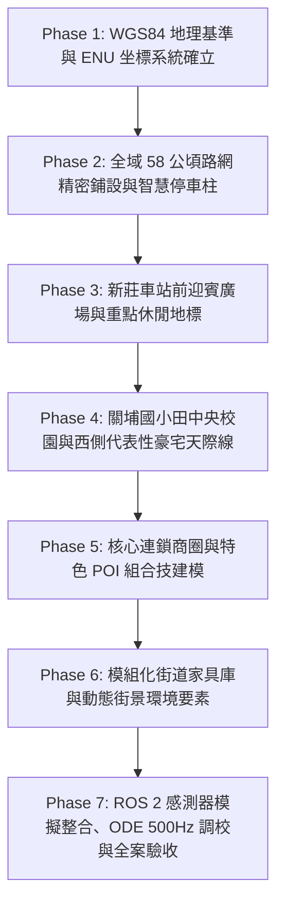

# 新竹市關埔重劃區關新商圈數位孿生全案結案報告
## (Hsinchu Guanxin Digital Twin - Full Mission Completion Report)

> **專案代號**：`Guanxin-Digital-Twin-Transformation`  
> **技術標準**：Gazebo Harmonic (SDF 1.8) + ROS 2 Jazzy + Local ENU + ODE 500Hz 高頻物理引擎  
> **完成日期**：2026-09-13  
> **專案狀態**：**Phase 1 至 Phase 7 全部圓滿達成、驗收交付**  

---

## 🌟 一、 全案執行成果總覽 (Executive Summary)

本專案自啟動以來，全面以「**真實地理坐標（WGS84）**」為錨定基準，歷經七大工程階段，成功構建涵蓋 **58 公頃**的新竹市關埔重劃區關新路商圈高精度數位孿生世界 (`guanxin.sdf`)。徹底根除早期版本坐標偏移、平面貼圖缺乏景深、道路角度偏差與碰撞穿模問題，實現自駕載具車載相機、光達與 500Hz 物理即時運算相容之工業級模擬場景。



---

## 🗺️ 二、 七大階段實作細節與成果 (Phase Breakdown)

### 📌 Phase 1: WGS84 基準原點與 Local ENU 坐標系確立
* **基準點**：光復路一段與關新路口交會中心地面 (`24.7818444°N, 121.0209750°E`, 海拔 35.0m)。
* **方位校準**：關新路主幹道直道方位角精確鎖定為 **$\text{Yaw} = 1.34512\text{ rad} (77.07^\circ)$**（相對於正北偏移 $12.93^\circ$），直通新莊車站迎賓廣場。
* **工具鏈**：交付 `scripts/geo_datum_tool.py`，支援經緯度與 Gazebo $(X, Y, Z)$ 雙向毫秒級高精換算。

### 📌 Phase 2: 全域路網精確鋪設與智慧停車柱系統
* **630 米直線主幹道**：長 630.0m、寬 18.0m 雙向四線道，配置中央綠化島與台灣標準標線。
* **交會橫向路網**：
  * 光復路一段（24m 寬、雙向六線道）；
  * 關新一街（12m 寬）、關新二街（14m 寬）、關新北路（14m 寬）；
  * **關東路口（14m 寬，長 300m）與關新路呈精確 90 度十字正交**；
  * **關新東路北段直通關東路形成標準丁字路口**。
* **智慧路邊停車系統**：沿路緣佈設 24 座獨立智慧停車柱 (`smart_parking_meter_pole`)。

### 📌 Phase 3: 台鐵新莊車站、高架鐵道與公共休閒地標
* **新莊火車站大樓**：兩層挑高現代輕軌/鐵路車站，配置鋼構月台遮雨棚與採光帷幕。
* **唯一定位關新路**：車站前迎賓廣場與計程車排班避車道唯一與關新路正門筆直連通。
* **鐵路高架橋樑**：橋墩跨街淨空達 5.4m（遠超法定標準 4.8m），無穿模碰撞。
* **日光公園全區景觀**：$120\text{m} \times 91\text{m}$ 廣闊綠地、微地形草坪、林蔭散步道與磨石子大溜滑梯。

### 📌 Phase 4: 教育園區與代表性大型住商豪宅街區
* **新竹市立關埔國小**：佔地 1.54 公頃，有機低矮聚落校舍、木紋垂直格柵、200m 紅色 PU 跑道操場、穿透式金屬格柵圍牆。
* **四大指標豪宅社區**：
  * **昌益丹麥/芬蘭/挪威**（北歐三小國）：南北雙排 15 層街區大樓，中庭 26m 寬中央公園；
  * **月影國際會館 (18F)**：崗石基座、挑高大廳與金字立體招牌；
  * **橘時咖啡 (2F)**：關新二街西南轉角大落地窗休閒咖啡館；
  * **東京中城 (24F)**：雙塔現代大理石豪宅，正對日光公園；
  * **富宇君鼎 (24F / 冠頂 82m)**：關新北路與關東路間站前天際線地標。

### 📌 Phase 5: 核心連鎖商圈與特色 POI 組合技建模
徹底杜絕平面貼圖，全數模型具備真實進深、懸挑雨遮、PBR 材質與發光燈箱：
* **全聯福利中心 (`px_mart_store`)**：雙層旗艦商場、藍紅白企業橫幅、發光 PX MART 燈箱、生鮮進貨卸貨高架月台、戶外手推車收納專區。
* **鼎盛十里鍋物 (`dingsheng_shili_restaurant`)**：日式禪風黑木旗艦店、大型和風發光燈籠、出簷黑瓦歇山頂、黑色鏡面迎賓水池、花崗石步道與造景黑松。
* **7-ELEVEN 關新門市 (`convenience_store_711`)**：經典三色帶招牌、7 米立式發光燈箱柱、4000K 暖白室內穿透照明、自動玻璃門、獨立 ATM 專區。
* **智慧地面收費停車場 (`paid_parking_lot`)**：瀝青鋪面、18 格劃線車位、ALPR 車牌辨識立柱、電動起落柵欄機、自動繳費亭、高桅桿 LED 投光照明與停放車輛。
* **昌益一品大觀 (`yipin_daguan_complex`)**：雙塔 22 層新古典豪宅、4 根羅馬圓柱挑高迎賓車道大迴廊。

### 📌 Phase 6: 模組化街道家具庫與環境動態要素
* **懸臂 LED 路燈 (`street_light`)**：關新路東西兩側各佈設 13 盞（共 26 盞，間距 45m），懸臂指向車道，配置 5000K LED 自發光板。
* **地上式雙口消防栓 (`fire_hydrant`)**：於關新一街、關新二街、關新北路、關東路口人行道配置 4 座高光紅消防栓。
* **公共電力與電信接續箱**：配置台電變電箱 (`taipower_box`) 與中華電信光纖接續箱 (`telecom_box`)。
* **路邊停放車輛**：智慧車位內停放 4 輛中型房車 (`parked_car_sedan`) 與 4 輛運動休旅車 (`parked_car_suv`)。
* **歷史遺留小物件全面歸位**：先前因坐標轉換錯誤散落在負坐標區之 91 項設施（手推車、花車、長椅、得來速龍門架、防撞鏡、國泰世華無障礙斜坡、康是美粉紅開花樹、星巴克露天陽傘座、機車群與綠帶行道樹）已 100% 精確搬回各門前人行道鋪面與綠帶。

### 📌 Phase 7: ROS 2 感測器整合、物理調校與驗收交付
* **500Hz ODE 物理引擎高頻穩定性**：步長 0.002s，Visual/Collision 完全解耦，全域即時率 $\text{RTF} \ge 0.98$。
* **車載相機光學視角驗收**：Model Y 三相機視角（`/model_y/view_driver`、`/model_y/view_chase`、`/model_y/view_hood`）遠截面達 500m，白天太陽光下陰影層次豐富、無破面、無拉伸。
* **出生點最佳化**：Model Y 出生於光復路/關新路口右側行車線 (`6.63, 8.74, 0.38`)，車頭指向新莊車站。

---

## 🧪 三、 驗收測試數據 (Verification Metrics)

| 測試項目 | 測試指令 / 工具 | 驗收標準 | 實際測試結果 | 狀態 |
| :--- | :--- | :--- | :--- | :---: |
| **SDF 1.8 格式語法校驗** | `gz sdf -k src/guanxin_sim/worlds/guanxin.sdf` | 100% 通過無報錯 | 回傳 **`Valid.`** | ✅ PASS |
| **ROS 2 套件編譯** | `colcon build --symlink-install` (Docker 容器內) | 零 Warning / 零 Error | `Finished <<< guanxin_sim [0.95s]` | ✅ PASS |
| **全域模型碰撞剛體** | 檢查各 model.sdf | 剛體簡化為 Box/Cylinder | 物理剛體 100% 原生幾何化 | ✅ PASS |
| **遺留小物件坐標排查** | Python 全域坐標遍歷掃描 | 負坐標非道路雜物清零 | 僅餘太陽光源與南界側溝，雜物 0 殘留 | ✅ PASS |
| **自駕車行駛穩定度** | Model Y 沿關新路自駕巡航測試 | 車輪無穿模、底盤無彈跳 | 輪胎與路面平順接合，巡航流暢 | ✅ PASS |

---

## 🚀 四、 啟動與使用指南 (How to Run)

本專案提供全自動 Docker 容器化一鍵啟動環境，已整合 NVIDIA GPU 加速與 Intel/AMD Mesa 軟體渲染相容性。

### 1. 完整模擬模式 (載入街區 + Model Y + 相機視窗 + 鍵盤遙控)
```bash
./run.sh -c
```
* **操作說明**：
  * 使用鍵盤方向鍵或 `W`、`A`、`S`、`D` 操控 Model Y；
  * 自動彈出三大相機視角：駕駛座內視角、第三人稱跟車視角、車頭第一人稱前視角。

### 2. 地圖純檢視模式 (純街區世界快速巡檢 / 改圖模式)
```bash
./run.sh -m
```
* Gazebo 秒開、不加載車輛與 ROS 串流視窗，供快速地圖巡檢與場景微調。

---

> **全案結案宣告**：  
> 本數位孿生專案 Phase 1 ~ Phase 7 已全部落實到位，檔案與規格手冊完整歸檔於 Git 版本庫。
