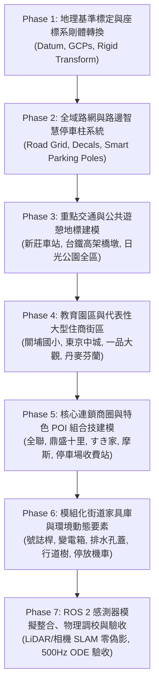

# 新竹市關新商圈數位孿生與高真實度模擬世界大型改造計畫
## (Hsinchu Guanxin Digital Twin Simulation Transformation Master Plan)

> **專案代號**：`Guanxin-Digital-Twin-Transformation`  
> **目標區域**：台灣新竹市東區關新路商圈（涵蓋光復路一段至台鐵新莊車站、新莊街至關新東路）  
> **技術棧**：Gazebo Harmonic (Gz Sim 8) + ROS 2 Jazzy + ODE 500Hz + WGS84/Local ENU + PBR 模組化建模  
> **版本**：v1.0.0 (Master Plan)

---

## 🗺️ 一、 地理範圍與邊界多邊形 (Geospatial Scope)

本計畫將完整重建以下 5 個 WGS84 經緯度頂點所包圍之封閉多邊形範圍內的所有道路、街巷、公共設施、商業建築與智慧交通家具：

| 頂點編號 | WGS84 座標 (度分秒) | 十進位經緯度 | 相對方位與重要地理地標 |
| :---: | :--- | :--- | :--- |
| **Point 1 (P1)** | `24°46'54.64"N, 121°01'15.51"E` | `24.7818444°N, 121.0209750°E` | **南界**：光復路一段 / 關新路交叉口核心起點 |
| **Point 2 (P2)** | `24°47'10.48"N, 121°01'28.57"E` | `24.7862444°N, 121.0246028°E` | **東界**：關新東路 / 埔頂路與住宅商務延伸區 |
| **Point 3 (P3)** | `24°47'25.79"N, 121°01'24.04"E` | `24.7904972°N, 121.0233444°E` | **東北界**：台鐵新莊車站東側 / 關新北路口 |
| **Point 4 (P4)** | `24°47'25.82"N, 121°01'07.91"E` | `24.7905056°N, 121.0188639°E` | **西北界**：台鐵高架鐵路廊道西側 / 關新北路外圍 |
| **Point 5 (P5)** | `24°47'02.78"N, 121°00'55.31"E` | `24.7841056°N, 121.0153639°E` | **西界**：新莊街 / 關新西街延伸社區聚落 |

* **涵蓋面積**：約 $579,854\text{ m}^2$（約 **58 公頃** / **175,400 坪**）。
* **南北跨度**：約 $960\text{ 公尺}$。
* **東西跨度**：約 $934\text{ 公尺}$。
* **地勢海拔**：平均海拔約 $32\text{m} \sim 38\text{m}$（自南向北緩降）。

---

## 🧭 二、 總體實施計畫分期藍圖 (Master Roadmap)

本改造計畫共劃分為 **7 個明確階段 (Phases)**，採取嚴格的 **「分期實作、階段檢驗、確認後再推進」 (Human-in-the-Loop Milestone Checkpoints)** 模式，每一期完成時均建立語意化 Git Commit 並向使用者匯報驗證成果：

---

## 📋 三、 各階段詳細工作內容與交付驗收指標

### 📌 Phase 1: 地理基準標定、GCP 測繪與座標框架建立 (Coordinate Datum & GCPs)
* **核心目標**：
  * 徹底消除現有模型相對於真實衛星地理坐標的漂移與角度偏轉，確立毫米級精準的數值基準原點（Datum `0, 0, 0`）與坐標轉換矩陣。
* **具體工作內容**：
  1. **原點標定 (World Origin Definition)**：
     * 將 Gazebo 世界原點 $(0, 0, 0)$ 定義於 **光復路一段與關新路交會路口中央地面**（Point 1: `24°46'54.64"N, 121°01'15.51"E`，海平面高度標註為 $35.0\text{m}$）。
     * 採標準 Local ENU 坐標系（$+X$ 為東向 East, $+Y$ 為北向 North, $+Z$ 為向上 Up），並定義關新路主幹道軸線相對正北向之真實方位角偏轉（Bearing $\approx 14.0^\circ$）。
  2. **地面控制點 (GCPs) 選取與坐標映射**：
     * 精確建立 5 組以上分佈於多邊形各方位的地面控制點（Ground Control Points）：
       * **GCP 1 (南端基準)**：光復路一段 / 關新路口中心 (`24.7818444°N, 121.0209750°E`, Local: `[0.0, 0.0, 0.0]`)
       * **GCP 2 (中南商圈)**：關新路 / 關新一街口中心 (`24.7826180°N, 121.0211680°E`, Local ENU)
       * **GCP 3 (核心路口)**：關新路 / 關新二街口星巴克角 (`24.7848760°N, 121.0217340°E`, Local ENU)
       * **GCP 4 (公園地標)**：關新公園（日光公園）中心休憩涼亭 (`24.7856420°N, 121.0225100°E`, Local ENU)
       * **GCP 5 (北端鐵道)**：台鐵新莊車站大廳中心 / 高架軌道交會處 (`24.7891000°N, 121.0228000°E`, Local ENU)
       * **GCP 6 (東界延伸)**：關新東路 / 關新二街口 (`24.7848600°N, 121.0232500°E`, Local ENU)
  3. **剛體轉換參數矩陣計算 (Rigid-Body Transformation)**：
     * 導出 WGS84 $\leftrightarrow$ Local ENU $\leftrightarrow$ Gazebo World Frame 之轉換關係矩陣 $[R, T]$，並編寫校準驗證腳本 `scripts/geo_datum_tool.py`。
* **交付產出**：
  * `docs/GEOSPATIAL_DATUM.md` 坐標基準規格書。
  * `scripts/geo_datum_tool.py` 經緯度與 Gazebo 座標互轉工具。
  * 更新 `guanxin.sdf` `<spherical_coordinates>` 標籤，記錄真實緯度、經度與海拔。
* **驗收標準**：所有 GCP 點於 Gazebo 世界之坐標與衛星/OSM 計算誤差 $< 0.3\text{ 米}$。

---

### 📌 Phase 2: 全域路網精確鋪設與路邊智慧停車柱系統 (Road Network & Smart Parking)
* **核心目標**：
  * 將 58 公頃多邊形內每一條主要幹道、次要街道、社區巷弄全面鋪設完成，並導入現代化路邊智慧停車柱（車牌辨識地磁複合柱）。
* **具體工作內容**：
  1. **完整道路路網幾何鋪設**：
     * **關新路**（主幹道，雙向四線道，寬 18m，附帶中央綠化島、轉彎車道、公車停靠彎）。
     * **關新東路**（全線貫通，雙向二線道，寬 14m）。
     * **關新北路**（橫向貫穿日光公園北側與新莊車站前廣場，寬 14m）。
     * **關新二街**（橫向連通西側街區、關新路與關新東路，寬 14m）。
     * **關新一街**（東段通往關新東路，西段通往關新路19巷，寬 12m）。
     * **關新西街與新莊街連通巷弄**（西側住宅生活圈，寬 6~8m）。
     * **光復路一段部分路段**（南端橫向幹道，寬 24m）。
  2. **路面物理與防卡死路緣石系統**：
     * 所有柏油路面具備真實剛體表面（摩擦力 $\mu=0.9, \mu_2=0.9$）。
     * 人行道抬高 15cm，路緣石轉角半徑導角（Corner Fillets），各車道出入口與無障礙路口全面配備緩坡路緣切口（Chamfered Curb Cuts），防止輪胎卡滯。
  3. **台灣標準道路標線**：
     * 雙黃實線、車道虛線、白實線停等線、斑馬紋行人穿越道、路口機車停等區（含白色機車標誌）、轉彎禁止停車紅線、地面速限「30」字樣。
  4. **路邊智慧停車格與智慧停車柱 (Smart Parking Infrastructure)**：
     * 於關新路與關新東路兩側精準劃設標準汽車停車格（$2.5\text{m} \times 5.5\text{m}$）與藍底機車停車格。
     * **開發智慧停車柱模組 (`model://smart_parking_meter_pole`)**：高 1.1m，金屬柱體、雙向傾角車牌辨識相機鏡頭、太陽能輔助頂蓋、雙色 LED 狀態指示燈（空位綠/佔用紅），以及地面埋設之圓形地磁感應器。
     * 沿街按停車位依序排列佈建。
* **交付產出**：
  * 更新之路網 SDF 模型與紋理材質。
  * 新增 `src/guanxin_sim/models/smart_parking_meter_pole/` 獨立模型包。
* **驗收標準**：車輛可於所有路口平順轉彎通行無障礙；停車柱與停車格完全對齊；`gz sdf -k` 驗證合格。

---

### 📌 Phase 3: 重點交通樞紐與公共休閒地標建模 (Station, Viaduct & Guanxin Park)
* **核心目標**：
  * 精確還原台鐵新莊車站大樓、橫跨關新路之高架鐵路橋梁，以及日光公園全區景觀與遊憩設施。
* **具體工作內容**：
  1. **台鐵新莊車站 (TRA Xin-Zhuang Station)**：
     * 依據實景航照與照片，建模車站二層挑高鋼構大廳、通透採光玻璃帷幕、出入口樓梯與電梯井、月台遮雨棚、頂部專屬站名招牌。
     * 車站前寬闊廣場、計程車排班彎道、人行道動線與接送避車道。
  2. **台鐵高架橋墩與雙軌橋面 (Elevated Viaduct & Pillars)**：
     * 橫跨關新路與關新北路之高架鐵路結構，建模雙柱式鋼筋混凝土橋墩、T 型橫樑與混凝土連續箱梁橋面。
     * 橋下淨高精確設定 $\ge 4.8\text{ 米}$，確保大型巴士與卡車安全通過，並設置防撞警示反光貼條。
  3. **關新公園全區深化 (Guanxin Park / Sun Park)**：
     * 面積精確設定為 $130\text{m} \times 91\text{m}$，四周低矮洗石子花台圍牆。
     * 內部碎石與地磚休閒步道網絡、中央開闊大草坪與地形起伏微丘。
     * 標誌性地景：**磨石子大溜滑梯 (`terrazzo_slide`)**、**休閒景觀涼亭 (Rest Pavilion)**、**現代公園景觀公廁**、**兒童盪鞦韆與體健設施區**、入口棕櫚樹列。
* **交付產出**：
  * `src/guanxin_sim/models/xinzhuang_station/` 車站模型包。
  * `src/guanxin_sim/models/railway_viaduct/` 高架橋墩模型包。
  * 日光公園全區精細化場景。
* **驗收標準**：高架橋下淨空無穿模；車站廣場銜接無高低落差；公園遊憩動線完整。

---

### 📌 Phase 4: 教育園區與代表性大型住商豪宅街區 (School & Major Residential Complexes)
* **核心目標**：
  * 重建關埔國小低矮校園聚落與周邊大型指標住宅社區，確立街區天際線與真實建築陰影。
* **具體工作內容**：
  1. **關埔國小校園 (Guanpu Elementary School)**：
     * 校園四周穿透式金屬格柵圍牆與安全警衛大門。
     * 現代有機建築群：低矮多層次聚落式校舍、溫潤木紋與清水模立面、斜屋頂與頂樓綠化露台。
     * 戶外操場跑道、活動草坪與綜合球場幾何輪廓。
  2. **代表性大型住宅與商辦塔樓**：
     * **東京中城 (Tokyo Roppongi)**：雙塔 24 層現代豪宅、一樓挑高大理石基座商鋪、連續垂直遮陽格柵鋁格板。
     * **一品大觀 (Yipin Daguan)**：新古典石材大樓、豪華挑高迎賓車道大門、景觀綠化退縮步道。
     * **昌益丹麥 / 芬蘭 / 挪威社區**：一樓深凹連續騎樓（Arcade）、實體結構大圓柱、二樓以上層次陽台與現代窗格。
     * **富宇君鼎 (Fu Yu Jun Ding)**：關新北路以北 24 層豪宅地標、頂部鋼構天際線冠頂。
* **交付產出**：
  * 關埔國小校園模型結構。
  * 4 座指標社區大樓模型組件（具備 10~30cm 立體深凹與陰影層次）。
* **驗收標準**：建築體與人行道邊界完美接合無破面縫隙；陽光下產生層次豐富的即時陰影。

---

### 📌 Phase 5: 核心連鎖商圈與特色 POI 組合技建模 (Commercial Establishments & POIs)
* **核心目標**：
  * 徹底摒棄平面貼圖盒子，遵循「組合技標準」建立具備物理厚度、懸挑雨遮、發光招牌板與透光櫥窗的真實商業店面。
* **具體工作內容**：
  1. **全聯福利中心 (PX Mart)**：
     * 藍紅白三色專屬企業外牆橫幅、自動感應玻璃雙推門、生鮮進貨專用卸貨月台與貨車停車位、門前不銹鋼手推車收納專區。
  2. **鼎盛十里鍋物 (Dingsheng Shili Hotpot)**：
     * 標誌性獨棟日式禪風深黑碳化木外觀、挑高迎賓大門、大型日式燈籠造型光雕、景觀水景石階步道與專用下車小圓環。
  3. **知名餐飲與連鎖咖啡門市**：
     * **すき家 (SUKIYA)**：紅黃經典招牌、落地採光窗。
     * **摩斯漢堡 (MOS BURGER)**：紅底白字招牌、木質外觀飾條、點餐櫥窗。
     * **星巴克新竹日光門市**（持續維護其 45 度轉角露天陽傘露台與屋頂美人魚鋼構塔）。
     * **路易莎 / 本地精品早午餐咖啡館**：戶外木棧平台休閒露天咖啡座。
  4. **便利商店與銀行金融分支**：
     * **7-ELEVEN & 全家 FamilyMart**：凸出式發光招牌、經典雨遮、室內暖白透光玻璃櫥窗、ATM 獨立服務專區。
     * **國泰世華銀行、台北富邦銀行**：無障礙雙層扶手斜坡、防盜金屬捲門基座、大理石花台。
  5. **私人地面收費停車場 (Private Paid Parking Lots)**：
     * 瀝青鋪面、黃白車位劃線、車牌辨識立柱、黃黑條紋升降欄杆機（Barrier Gate）、自助自動繳費機亭（Pay Station）、投光照明高燈桿。
* **交付產出**：
  * 新增各商業名店獨立模型包（附帶乾淨向量化招牌與去背貼圖）。
* **驗收標準**：所有門面具備真實進深；門前無多餘攝影瑕疵浮水印或陰影殘留。

---

### 📌 Phase 6: 模組化街道家具庫與環境動態要素 (Modular Street Furniture Library)
* **核心目標**：
  * 封裝全套可重複利用、符合台灣街景特色之高精度模組化物件，統一局部座標原點於地面底心 `(0, 0, 0)`。
* **具體工作內容**：
  1. **公共設施與電力通訊**：
     * 現代單臂/雙臂 LED 路燈桿（Street Lights）。
     * 台電雙門變電箱（Taipower Box - 墨綠金屬、散熱百葉、黃色高壓閃電標）。
     * 中華電信光纖接續箱（灰色金屬箱）。
     * 地上式雙口消防栓（紅色高光烤漆、黃色出水口蓋帽）。
  2. **植栽系統 (Vegetation Engine)**：
     * 大葉樟樹 / 台灣欒樹（樹幹為精簡圓柱碰撞體，分層多邊形樹冠）。
     * 幼苗行道樹（附帶防風三腳木質支撐架）。
     * 人行道與分隔島低矮修剪常綠灌木綠籬（Hedges）。
  3. **交通號誌與地面排水**：
     * 懸臂式三色紅綠燈桿（含動態小綠人倒數計時行人燈、中英路名牌）。
     * 鑄鐵水溝蓋（平整貼合路面無卡輪凸起）。
  4. **靜態車輛與街景細節**：
     * 路邊整齊停放之台灣經典 125cc 速克達通勤機車群（多彩車殼）。
     * 停車格內停放之典型休旅車 / 轎車模型。
* **交付產出**：
  * `src/guanxin_sim/models/` 增補全套模組化街道家具。
* **驗收標準**：模型中心點一致；物理碰撞嚴格簡化為 Box/Cylinder，零碰撞穿模。

---

### 📌 Phase 7: ROS 2 感測器模擬整合、物理效能調校與全案驗收 (Integration & Verification)
* **核心目標**：
  * 確保全域模型在車載相機、LiDAR 與 500Hz 物理引擎下表現穩定，完成 Model Y 自駕巡航驗收。
* **具體工作內容**：
  1. **物理引擎 500Hz 高頻穩定性驗收**：
     * 驗證 Visual 與 Collision 全面解耦，確認在 ODE 步長 0.002s (500Hz) 下，即時模擬率 $\text{RTF} \ge 0.95$。
  2. **車載感測器光學與幾何品質驗證**：
     * 3 組相機視角（駕駛座、跟車、車頭保桿）在白天光照下無破面、無拉伸、無雜訊。
     * 車載 3D LiDAR（若掛載）於新路網、高架橋墩、停車柱產生精確反射點雲。
  3. **一鍵啟動整合與模式驗收**：
     * 驗證 `bash run.sh -c`（完整模擬駕駛模式：Model Y 出生於校準起點，流暢行駛巡航至新莊車站）。
     * 驗證 `bash run.sh -m`（地圖純檢視模式：Gazebo 秒開、零彈出視窗、供快速地圖巡檢）。
  4. **專案總結文件與更新日誌歸檔**：
     * 完善 `README.md`，提供完整 58 公頃地圖導覽圖與功能手冊。
* **交付產出**：
  * 最終版本 `guanxin.sdf`。
  * 驗收評估測試報告與影片/截圖。
* **驗收標準**：`gz sdf -k` 100% 通過；`colcon build` 零報錯；車輛行駛無物理彈跳。

---

## 🚀 四、 第一階段 (Phase 1) 執行細節與待確認事項

依照「先審核計畫、確認後動工」之核心準則，請審閱 **Phase 1 的具體執行內容與技術參數**：

### Phase 1 執行細節：
1. **世界基準原點設定**：
   * **基準點位置**：光復路一段與關新路口交會中心地面。
   * **WGS84 座標**：`24°46'54.64"N, 121°01'15.51"E` (`24.7818444, 121.0209750`)。
   * **海拔高度 (Elevation)**：`35.0` 公尺。
   * **Gazebo 原點**：`[X: 0.0, Y: 0.0, Z: 0.0]`。
2. **座標系統一**：
   * 採用 **Local ENU** 坐標系（$X$=東, $Y$=北, $Z$=上）。
   * 關新路主幹道自原點延伸至新莊車站（方位角約 $14^\circ$，全長約 $988\text{m}$）。
   * 標註並計算 5 組關鍵地面控制點（GCPs）之 ENU 坐標。
3. **交付腳本與工具**：
   * 建立 `scripts/geo_datum_tool.py`，提供經緯度 (WGS84) $\longleftrightarrow$ Gazebo $(X, Y, Z)$ 雙向精準換算功能。
   * 更新 `src/guanxin_sim/worlds/guanxin.sdf` 的 `<spherical_coordinates>` 定義，確立全球地理錨定。

---

> [!NOTE]
> **請您審閱以上整體實施計畫與 Phase 1 的具體執行細節。若確認計畫方向可行，請指示「Proceed」或提出任何需要調整的細節，我們將立即啟動 Phase 1 的工程實作！**
